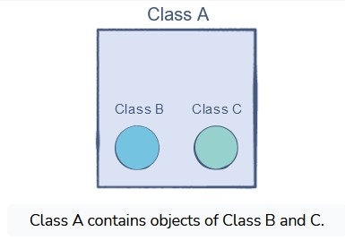

# Association

In object-oriented programming, association is the common term **used for both the has-a and part-of relationships** but is not limited to these. When we say that two classes are associated with each other, this is a generic statement which means that we don’t worry about the lifetime dependency between the objects of these classes.

# IS

Wherever we come across an IS A relationship between objects, we can use inheritance.


# Part-Of

class B and class C have their own implementations, but their objects are part-of the implementation of Class A and are only created once a class A object is created.
In a part-of relationship between two classes at least one class must be a part of the other but not both classes must be a part of the other.



## Composition
Composition is the practice of accessing other class objects in your class. In such a scenario, the class which creates the object of the other class is known as the owner and is responsible for the lifetime of that owner object.

Composition relationships are Part-of relationships where the part must be a constituent of the whole object and cannot exist independently of the whole. We can achieve composition by adding the classes together like parts in another class to make a complex unit.

So, what makes the composition unique?
In composition, the lifetime of the owned object depends on the lifetime of the owner.

In followed example VendingMachine class is responsible for the lifetime of the owned objects, i.e.

```c#
class Display { // Display class

  public Display(){} // Parameter-less constuctor
  public void WelcomeMessage { // Method to welcome a customer
    Console.WriteLine("Welcome to the Vending Machine")
  }
  public void DisplayMethod() // Method to show the machine menu
  {
            Console.Write(@"
.-----.---------------------.
|Press|       Action        |
|-----|---------------------|
|  1  |    Feed Money       |
|  2  |    Select a Product |
|  3  |    Get Change       |
|  4  |    Quit             |
'-----'---------------------'");

}

class KeyPad { // KeyPad class

  public KeyPad(){} // Parameter-less constructor
  public int readKey() // Mehtod to read the user input
  {
      string userInput;
      userInput = Console.ReadLine();
      /* Convert to integer type as the keypad should only have integer inputs */
      int value;
      if (int.TryParse(userInput, out value) && value > 0)
      {
          return value;
      }
      else return -1;
  }

}


class VendingMachine { // Owner class
  // Fields of VendingMachine class
  private Display _machineDisplay; 
  private KeyPad _machineKeyPad;
  // Constructor of VendingMachine class
  public VendingMachine(){
    // Creating Owned Objects
    this._machineDisplay = new Display();
    this._machineKeyPad = new KeyPad();
  }
  /* The above Display and KeyPad objects can be used here*/
}
```

# Has-a

This is a slightly less concrete relationship between two classes. Class A and class B hold a has-a relationship if one or both need the other’s object to perform an operation, but both class objects can exist independently of each other.

This implies that a class has-a reference to an object of the other class but does not decide the lifetime of the other class’s referenced object.


## Aggregation 
Aggregation is a specialized form of association. It follows the Has-A model. In aggregation, a class uses the objects of other classes. Here, we will refer to the class, **using** the objects of other classes, as the container class, and the classes whose objects are being used as the contained classes.

The container class contains the references to the objects of the contained classes.

### Independent Lifetimes
In aggregation, the lifetime of the contained object does not depend on the lifetime of the container object.

```c#
class VendingMachine
{

    private Product[] _productShelf;
    private int _capacity;
    private static int _productCount;


    public VendingMachine()
    {
        this._productShelf = new Product[5];
        this._capacity = 5;
        _productCount = 0;
    }
    public bool InsertProduct(Product item)
    {
        if (_productCount < _capacity)
        {
            this._productShelf[_productCount] = item;
            _productCount++;
            return true;
        }
        else
        {
            return false;
        }
    }

    public void PrintProducts()
    {
        for (int i = 0; i < this._capacity; i++)
        {
            _productShelf[i].PrintDetails();
        }
    }

}

public class Product
{

    private string _name;
    private double _price;

    public Product(string name, double price)
    {
        this._name = name;
        this._price = price;
    }

    public void PrintDetails()
    {
        Console.Write("[{0}  {1}]\t\t", this._name, this._price);
    }

}

class Demo
{

    public static void Main(string[] args)
    {
        // Creating Vending Machine
        VendingMachine myVendy = new VendingMachine();
        // Creating Products
        Product snack = new Product("Rango Tango", 0.5);
        Product drink = new Product("Mineral Water", 0.7);
        Product chocolate = new Product("Crunchy", 1);
        Product energyDrink = new Product("Red Bull", 3);
        Product popcorn = new Product("Caramel pop", 0.5);
        // Inserting Products into machine
        myVendy.InsertProduct(snack);
        myVendy.InsertProduct(drink);
        myVendy.InsertProduct(chocolate);
        myVendy.InsertProduct(energyDrink);
        myVendy.InsertProduct(popcorn);
        // Printing the product in vending machine
        myVendy.PrintProducts();
        // Now if we null the myVend
        myVendy = null;
        // The products still exist and are still usable
        Console.WriteLine("\nThe Products still exist!");
        snack.PrintDetails();
        drink.PrintDetails();
        chocolate.PrintDetails();
        energyDrink.PrintDetails();
        popcorn.PrintDetails();
    }

}
```

> `Output:`

```md
[Rango Tango  0.5]		[Mineral Water  0.7]		[Crunchy  1]		[Red Bull  3]		[Caramel pop  0.5]		
The Products still exist!
[Rango Tango  0.5]		[Mineral Water  0.7]		[Crunchy  1]		[Red Bull  3]		[Caramel pop  0.5]		
```