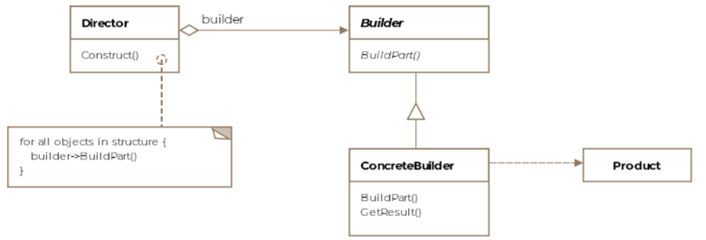

# Creational

- [Builder](builder.md)
- [Singleton](singleton.md)
- [ProtoType](prototype.md)
- [FactoryMethod](factorymethod.md)
- [AbstractFactory](abstractfactory.md)

Creational design patterns relate to how objects are constructed from classes. New-ing up objects may sound trivial but unthoughtfully littering code with object instance creations can lead to headaches down the road. The creational design pattern come with powerful suggestions on how best to encapsulate the object creation process in a program.

- [x] **Builder Pattern**
- [x] **Prototype Pattern**
- [x] **Singleton Pattern**
- [x] **Abstract Factory Pattern**

## Builder Pattern
The builder pattern is used to create objects. It seperates out how the object is represented and how it is created. Additionally, it breaks down the creation into multiple steps. For instance in Java the java.lang.StringBuilder is an example of the builder pattern.

<figure markdown>
{ width=600 height=400 align=center }
<figcaption>Builder</figcaption>
</figure>

## Singleton Pattern
The singleton pattern is applied to restrict instantiation of a class to only one instance. For instance in the Java language the class java.lang.Runtime is a singleton.

<figure markdown>
{ width=600 height=400 align=center }
<figcaption>Singleton</figcaption>
</figure>

## Prototype Pattern
Prototype pattern involves creating new objects by copying existing objects. The object whose copies are made is called the prototype. In Java the clone() method of java.lang.Object is an example of this pattern.

<figure markdown>
{ width=600 height=400 align=center }
<figcaption>Prototype</figcaption>
</figure>

## Factory Method Pattern
The factory method is defined as providing an interface for object creation but delegating the actual instantiation of objects to subclasses. For instance the method getInstance() of the class java.util.Calendar is an example of a factory method pattern.

<figure markdown>
{ width=600 height=400 align=center }
<figcaption>Factory</figcaption>
</figure>

## Abstract Factory
The abstract factory pattern is defined as defining an interface to create families of related or dependent objects without specifying their concrete classes.The abstract factory is particularly useful for frameworks and toolkits that work on different operating systems. For instance, if your library provides fancy widgets for the UI, then you may need a family of products that work on MacOS and a similar family of products that work on Windows.

<figure markdown>
{ width=600 height=400 align=center }
<figcaption>Abstract Factory</figcaption>
</figure>