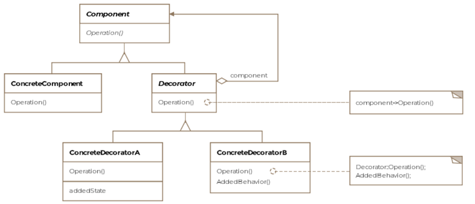
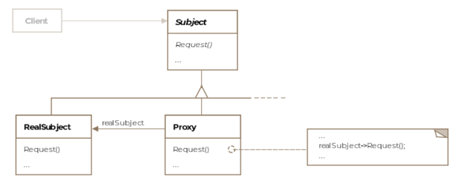

# Structural

- [Decorator](decorator.md)
- [Proxy](proxy.md)

Structural patterns are concerned with the composition of classes i.e. how the classes are made up or constructed. These include:

- [x] Adapter Pattern
- [x] Bridge Pattern
- [x] Composite Pattern
- [x] **Decorator Pattern**
- [x] Facade Pattern
- [x] Flyweight Pattern
- [x] **Proxy Pattern**

## Decorator Pattern
The decorator pattern can be thought of as a wrapper or more formally a way to enhance or extend the behavior of an object dynamically. The pattern provides an alternative to subclassing when new functionality is desired. A prominent example of this pattern is the java.io package, which includes several decorators. For example the BufferedInputStream wraps the FileInputStream to provide buffering capabilities.

<figure markdown>
{ width=600 height=400 align=center }
<figcaption>Decorator</figcaption>
</figure>

## Proxy Pattern
In a proxy pattern setup, a proxy is responsible for representing another object called the subject in front of clients. The real subject is shielded from interacting directly with the clients. The java.rmi.* package contains classes for creating proxies. RMI is Remote Method Invocation. It is a mechanism that enables an object on one Java virtual machine to invoke methods on an object in another Java virtual machine.

<figure markdown>
{ width=600 height=400 align=center }
<figcaption>Proxy</figcaption>
</figure>

## Adapter Pattern
The Adapter pattern allows two incompatible classes to interoperate that otherwise can't work with eachother. Consider the method asList() offered by java.util.Arrays as an exampe of the adapter pattern. It takes an array and returns a list.

## Bridge Pattern
The bridge pattern describes how to pull apart two software layers fused together in a single class hierarchy and change them into parallel class hierarchies connected by a bridge

## Composite Pattern
The pattern allows you to treat the whole and the individual parts as one. The closest analogy you can imagine is a tree. The tree is a recursive data-structure where each part itself is a sub-tree except for the leaf nodes.

## Facade Pattern
The facade pattern is defined as a single uber interface to one or more subsystems or interfaces intending to make use of the subsystems easier.

## Flyweight Pattern
The pattern advocates reusing state among a large number of fine grained object. Methods java.lang.Boolean.valueOf() and java.lang.Integer.valueOf() both return flyweight objects.
