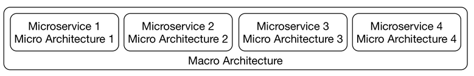

## Architecture
### Macro
#### Macro with Micro
he overarching macro architecture applies to all microservices, whereas the micro architecture deals with individual microservices so that each microservice has its own microarchitecture.
It matter, if the microservices can work with each other. So we need to have macro for them to work with each other.

- [x] The micro architecture comprises all decisions that can be made individually for each microservice.
- [x] The macro architecture consists of all decisions that can be made at a global level and apply to all microservices.

<figure markdown>
{ width=600 height=400 align=center }
<figcaption>Micro and Macro Architecture</figcaption>
</figure>

### DDD
#### Bounded context and strategic design
A macro architecture divides the domains into coarse-grained modules. These modules are further divided as part of the micro architecture.

#### An example for a domain architecture

The drawing above shows an example of the division of a system into multiple domain modules. In this division, each module has its own domain model. Let’s discuss each.
- [x] **To search** successfully, data, such as descriptions, images or prices, must be stored for the products. Important customer data can include, for example, the recommendations that can be determined based on past orders.
- [x] To process orders in the **order process** module, the contents of the shopping cart have to be tracked. For products, only basic information is required such as name and price. Similarly, not too much data concerning the customer is necessary. The most important component of the domain model of this module is the shopping cart. It is then turned into an order that has to be handed over and processed by the other bounded contexts.
- [x] For **payment**, the payment-associated information like credit card numbers has to be kept for each customer.
- [x] For **shipping**, the delivery address is required information about the customer while the size and the weight are necessary information about the product.
This list reflects that the modules require different domain models. Not only does the data concerning customer and product differ but so does the entire model and the logic.

#### Domain-driven design: definition
Domain-driven design (DDD) offers a collection of patterns for the domain model of a system. For microservices, the patterns in the area of strategic design are the most interesting. They describe how a domain can be subdivided.
Consequently, search, order process, payment, and shipping are such bounded contexts because they each have their own domain model.

Here are some books you could look into if you are interested in Domain-Driven Design:

- [x] Domain-driven design offers many more patterns that, for example, facilitate the model of individual modules. The original [DDD book](https://www.amazon.com/Domain-Driven-Design-Tackling-Complexity-Software/dp/0321125215) provides a lot more information. It introduces the term “domain-driven design” and comprehensively describes DDD.
- [x] The more compact book [Domain-driven Design Distilled](https://www.amazon.com/Domain-Driven-Design-Distilled-Vaughn-Vernon/dp/0134434420) focuses on design, bounded context, and domain events.
- [x] The [Domain-Driven Design Reference](https://domainlanguage.com/ddd/reference/) is also by the author of the original DDD book. It contains all DDD patterns but without any additional explanation or examples.

#### Multiple bounded contexts

It would be conceivable to implement a domain model that comprises multiple bounded contexts. However, such a model would not be the easiest solution.

For example, a price change affects search; however, it must not result in a price change for orders that have already been processed in payment. It is easier to store only the current price of a product in the bounded context search, and to store the price of the product of each order in payment, which can also comprise rebates and other complex logic.

Therefore, the simplest design consists of multiple specialized domain models that are valid only in a certain context. Each domain model has its own model for business objects such as customers or products.

`Each domain model is valid only in a bounded context`

#### Domain events between bounded contexts
For the communication between bounded contexts, we can use domain events.

Events can be useful for integrating bounded contexts. Domain events are a part of the domain model as they represent something that happened in the domain. That means they should also be relevant to domain experts.

`Example`
- [x] Ordering a shopping cart can be modeled as such an event.
- [x] This event is triggered by the bounded context order process and is received by the bounded contexts shipping and payment to initiate shipping and invoicing of the order.

#### Bounded contexts and microservices
Bounded contexts divide a system by domains. They do not have to be microservices. They can also be implemented as modules in a deployment monolith.
However, since the microservices are part of a larger system, dependencies between the modules cannot be completely avoided.

#### Evolution

There are a number of reasons why new bounded context, and therefore new microservices, might be created:

1. Over time, new functionalities might justify new bounded contexts.
2. It might become apparent that one bounded context should really be split into two. That might be the case because new logic is added to the bounded context, or the team understands the bounded context better.
3. New microservices might be created by dividing a current one due to a technical reason (recall division by technicality!).
    *One reason may be to make scalability easier. A microservice may be split in two since the resulting microservices will be smaller and therefore easier to scale. Such reasons might also lead to a larger number of microservices.*

