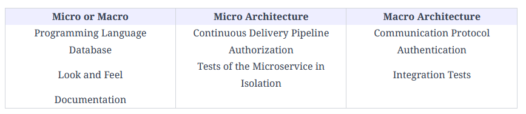

## DB Level

Micro: Each microservice can also have its own instance of the database. If databases were defined at the micro architecture.

Macro: To avoid needing many different databases, the database can be defined as part of the macro architecture for all microservices.

# UI Level

Micro: sometimes a system has different types of users (back office and customers, for example) with different requirements for the UI which are often incompatible with a uniform look and feel. A micro architecture decision for the UI is suitable in this case.

Macro: Often a system should have a uniform UI; therefore, the look and feel must be a macro architecture decision.

## Documentation Level

Micro: The documentation should be part of the micro architecture if the same team will build and maintain the microservice.

Macro: Of course, the decision about the documentation can also be part of the macro architecture.

## Communication protocol Level

The communication protocol of the microservices is a typical macro architecture decision.

Only if all microservices provide a uniform interface, for example, a REST interface or a messaging interface, can they communicate with each other coherently.
In addition, the data format must be standardized. It makes a difference whether systems communicate with JSON or XML, for example.

If the communication protocol was a microservice decision, i.e., a different communication channel between each microservice, a coherent system will not exist and will disintegrate into islands that communicate with each other in different ways.
Authentication

With authentication, a user proves their identity. This can be done with a password and a username, to name a common example.

Since it is unacceptable for the user to re-authenticate with every microservice, the entire microservice system should use a single authentication system. The user then enters a username and password once and can then use any microservice.
Integration

Integration testing technology is also a typical macro architecture decision. All microservices must be tested together, so they must run together in an integration test. The macro architecture must define the necessary prerequisites for this.
Typical micro architecture decisions

Certain decisions should be taken for each microservice individually. Therefore, they are typically part of the micro architecture.
Authorization

The authorization of the user determines what a user is allowed to do. The authorization should be done in the respective microservice.

Which user is allowed to initiate what action, i.e., authorization, is part of the domain logic, and therefore belongs to the microservice like the other domain logic.

If this was decided at the macro architecture, the domain logic would be implemented in a microservice itself, but the decision about which part of the domain logic is available to which user would be made centrally, which is difficult, especially with complex rules.

For example, if orders up to a certain upper limit can be triggered by certain users, authorization, concrete upper limits, and possible exceptions belong to the microservice order.

Authentication assigns the user roles used in authorization.

For example, a microservice can define which actions a user with the role of customer can trigger and which actions a user with the role of call center agent can trigger.

## Test Level

The testing can be different for each microservice. Even the tests are ultimately part of the domain logic.

In addition, there may be different non-functional requirements for each microservice.

    For example, one microservice can be particularly performance-critical, whereas another is more safety-critical.

These risks must be covered by an individual focus in the tests.

Since the tests can be different, the continuous delivery pipeline is also different for each microservice. It must include the relevant tests. Of course, the technology for the continuous delivery pipeline can be standardized.

For example, each pipeline can use a tool like Jenkins. What happens in the respective pipelines, however, depends on the respective microservice.

<figure markdown>
{ width=600 height=400 align=center }
<figcaption>Descision</figcaption>
</figure>