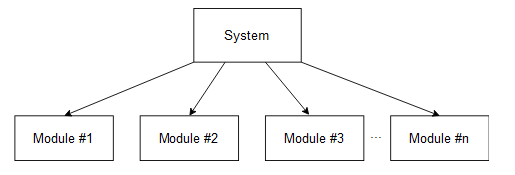
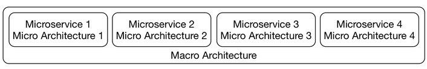
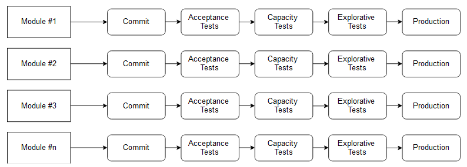
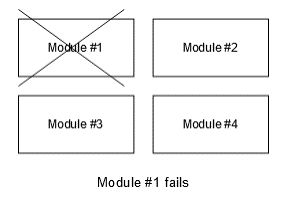

## Independent Systems Architecture Principles
ISA (Independent Systems Architecture) is the term for a collection of **fundamental principles for microservices.** It is based on experiences with microservices gained from many different projects.
The name already suggests that these principles aim to build software out of independent systems. Macro and micro architecture are very important for this goal.
A minimal macro architecture leaves a lot of freedom to the level of the micro architecture, making the systems independent. Technical decisions can be made for each system without influencing the other systems.
**ISA defines the term micro and macro architecture.** Also, the principles explain what the minimum requirements for macro and micro architecture are.

### Conditions

Must is used for principles when they absolutely have to be adhered to.

Should describes principles which have many advantages but do not have to be strictly followed. We’ll now discuss each principle. The ISA principles are not only a great guideline for building microservices, but they also explain why macro and micro architecture are so important.

#### Principle #1: The system must be divided into modules

The system must be divided into modules that offer interfaces. Accessing modules is only possible via these interfaces. Therefore, modules may not depend directly on the implementation details of another module, such as the data model in a database.

`Evaluation`
The first ISA principle states that a system must be built from modules. This is common knowledge.

<figure markdown>
{ width=600 height=400 align=center }
<figcaption>System Modularization</figcaption>
</figure>

#### Principle #2: Two separate levels of architectural decisions

The system must have two clearly separated levels of architectural decisions:

- [x] Macro architecture comprises decisions which concern all modules. All further principles are part of the micro architecture.
- [x] Micro architecture comprises those decisions which can be made differently for each individual module.

`Evaluation`

The second principle defines two levels of architecture: macro and micro architecture.

<figure markdown>
{ width=600 height=400 align=center }
<figcaption>Micro Macro</figcaption>
</figure>

#### Principle #3: Modules must be separate processes/containers/VMs

Modules must be separate processes, containers, or virtual machines to maximize independence.

`Evaluation`

In a deployment monolith, most of the decisions will be on the macro architecture level. For example, a deployment will be written in one programming language, so the programming language has to be a decision on the macro architecture level. The same is true for frameworks and most of the other technologies.

To make more decisions on the micro architecture level, each module must be implemented in a separate container as this principle states. ISA says that the reason why microservices run in containers is the additional technological freedom that cannot be achieved in a deployment monolith. Therefore, microservices add more independence and decoupling to the architecture.

An approach where each microservice is a WAR and all run together in one Java application server does not fit this principle. Actually, the compromise concerning the free choice of technology and the robustness is so high that this approach usually does not make a lot of sense.

Because decoupling is so important, ISA and microservices actually provide fundamental improvements to modularization.

<figure markdown>
{ width=600 height=400 align=center }
<figcaption>Modules are separate processes/containers/virtual machines</figcaption>
</figure>

#### Principle #4: Standardized integration & communication

The choice of integration and communication options must be limited and standardized for the system.

    The integration might be done with synchronous or asynchronous communication, and/or on the UI level.
    Communication must use a limited set of protocols like RESTful HTTP or messaging. It might make sense to use just one protocol for each integration option.

`Evaluation`

Although the goal of ISA is to create a minimal macro architecture, some decisions still need to be made on the macro level. This is what the rest of the principles explain. As a start, principle four states that integration and communication must be standardized. The last three chapters of this course discuss a few technology stacks for integration and communication.

The decision to use a specific technology for integration and communication influences all modules and must, therefore, be done on the macro architecture level. It is therefore also a very important decision in microservices systems.

Without a common integration approach and communication technology, it is hard to consider the system as a system and not just a few services that can barely communicate with each other.

#### Principle #5: Standardized metadata

Metadata, for example, for authentication, must be standardized. Otherwise, the user would need to log in to each microservice.

    This might be done using a token that is transferred with each call/request.
    Other examples might include a trace ID to track a call and its dependent calls through the microservices.

`Evaluation`

This principle states that metadata for tracing and authentication must be standardized. Such metadata must be transferred between the microservices and must, therefore, also be a part of the macro architecture. This course does not discuss security aspects of microservices, including metadata for authentication.

#### Principle #6: Independent continuous delivery pipelines

Each module must have its own independent continuous delivery pipeline. Tests are part of the continuous delivery pipeline; therefore, the tests of the modules have to be independent, too.

`Evaluation`

This principle extends the idea of independent deployment as the definition of microservices from the last chapter.

<figure markdown>
{ width=600 height=400 align=center }
<figcaption>Each module has it's own independent continuous delivery pipeline</figcaption>
</figure>

#### Principle #7: Operations should be standardized

Operations should be standardized. There can be exceptions from the standard when a module has very specific requirements. These operations comprise:

- [x] configuration
- [x] deployment
- [x] log analysis
- [x] tracing
- [x] monitoring
- [x] alarms

`Evaluation`

This principle says that the operations of microservices should be standardized. It is not in all cases necessary to standardize operations. With a separate operations department, standardization is the only way to handle a large number of microservices.

However, with a “you build it – you run it” organization, standards are not necessary as each team operates their microservices. Actually, a standardized operations approach might not fit all microservices. In that case, the teams need to come up with their own operations technologies. A standard may not be useful then.

#### Principle #8: Standardized interface

Standards for operations, integration, or communication should be enforced on the interface level.

For example, the communication protocol and data structures could be standardized to a specific JSON payload format exchanged using HTTP, but every module should be free to use a different REST library/implementation.

`Evaluation`

This principle states that standards should only be defined on the interface level. The technologies discussed throughout the last three chapters can be used in this way. They provide interfaces and client libraries for all commonly used programming languages.

#### Principle #9: Modules have to be resilient

Modules have to be resilient. This means that:

- [x] They may not fail when other modules are unavailable or when communication problems occur.
- [x] They must be able to shut down without losing data or state.
    It must be possible to move them to other environments (server, networks, configurations and so on) without the module failing.

`Evaluation`

This principle addresses resilience. Asynchronous communication makes resilience easier. If a microservice fails, a message will be transferred later but the failed microservice will not cause another microservice to fail.

<figure markdown>
{ width=600 height=400 align=center }
<figcaption>Modules must be resilient</figcaption>
</figure>