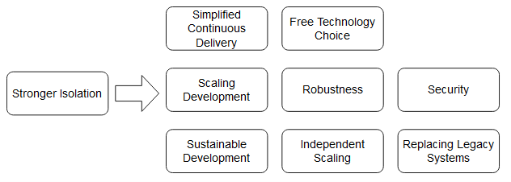

## Microservice

Microservices are independently deployable modules. In practice, microservices can vary hugely in size. New microservices can replace parts of the old system.
A key feature of the microservices architecture is that a new version of the entire application is not deployed when a change is made to any one microservice.
Thus, with the help of microservices, teams can act independently regarding domain logic and technology. This minimizes the coordination effort required for large projects.
No pre-existing codebase has to be used. In addition, developers can employ a completely different technology stack.

### Advantages of this microservice definition

The definition of microservices as independently deployable modules has several advantages:

- [x] It is very compact.
- [x] It is very general and covers all kinds of systems which are commonly denoted as microservices.
- [x] The definition is based on modules and is thus a well-understood concept. This allows us to adopt many ideas concerning modularization. This definition also highlights that microservices are part of a larger system and cannot function entirely on their own. Microservices have to be integrated with other microservices.
- [x] The independent deployment is a feature that creates numerous advantages and is therefore very important. Thus, the definition, in spite of its brevity, explains what the most essential feature of a microservice really is.

## Sustainable development 
### Replaceability of microservices
To achieve replaceability, the dependencies between microservices have to be managed appropriately.
Why is it NOT likely that a developer will introduce a new dependency between two modules in a microservice architecture?
Because microservices have clear boundaries due to their interface and to introduce a dependency, they will have to call it.

### Dependencies have to be managed 
Microservices have **clear boundaries due to their interface** irrespective of whether the interface is implemented as a REST interface or via messaging.
When a developer introduces a new dependency on such an interface, they will notice this because the interface has to be called appropriately. For this reason, **it is unlikely that architecture violations will occur at the level of dependencies between microservices.**
The interfaces between microservices are in a way architecture firewalls since they prevent architecture violations. The concept of architecture **firewalls is also implemented by architecture management tools like Sonargraph, Structure101, or jQAssistant**. Advanced module concepts can also, generate such a firewall. In the Java world, **OSGi** limits access and visibility between modules. Access can even be restricted to individual packages or classes.

The architecture at the level of dependencies between microservices also remains maintainable. **Developers cannot unintentionally add dependencies between microservices.** Therefore, microservices can ensure a high architecture quality in the long term both inside each microservice and between the microservices.

## Continuous delivery 
Continuous delivery is an approach where software is continuously brought into production with the help of a continuous delivery pipeline. The pipeline brings the software into production via different phases.

### Phases
Typically, the **software compilation, unit tests, and static code analysis are performed in the commit phase**.
 In the **acceptance test phase**, automated tests assure the **correctness of the software** regarding domain logic.
    **Capacity tests check the performance** at the expected load.
**Explorative tests** serve to perform not-yet-considered tests or to examine new functionalities. In this manner, **explorative tests can analyze aspects that are not yet covered by automated tests.**
In the end, the software is brought into production.

Microservices represent independently deployable modules. Therefore each microservice has its own continuous delivery pipeline.
Setting up an environment to **integration test a microservices architecture can be complicated.**

## Microservices facilitate continuous delivery
The continuous delivery pipeline is significantly faster because the deployment units are smaller. 

The tests are also faster because they need to cover fewer functionalities.

Building up a continuous delivery pipeline is easier for microservices. Setting up an environment for a deployment monolith is complicated.

The deployment of a microservice poses a smaller risk than the deployment of a deployment monolith.

## Robustness
When a memory leak exists in a microservice, only this microservice is affected and crashes. The other microservices keep running. Of course, they have to **compensate for the failure of the crashed microservice; this is called resilience.**

## Independent scaling 
Most of the time, scaling the whole system is not required. 

Each microservice can be independently scaled.

 the microservices naturally have to fulfill **certain requirements. For example, they must be stateless**. Otherwise, requests of a specific client cannot be transferred to another instance, because this instance then would not have the state specific to that client.

In the case of a microservice, **the scaling can be more fine-grained** so that normally fewer additional services are necessary and the basic requirements are less complex.

## Security 
For example, it is possible to introduce **firewalls** into the communication between microservices.
Besides, the **communication between microservices can be encrypted** to guarantee that the communication really originates from another microservice and is authentic.

## Isolation 
In the end, many advantages of microservices can be traced back to a stronger isolation.

<figure markdown>
{ width=400 height=200 align=center }
<figcaption>Isolation as the Source of the Advantages of Microservices</figcaption>
</figure>