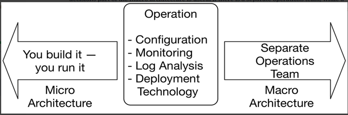

## Operation: Micro or Macro Architecture?

Some decisions in the area of micro and macro architecture mostly influence the operation of the applications. Let’s take a look at a few.

### Configuration

We must define the interface with which a microservice obtains its configuration parameters. For example, a microservice can get these settings via an environment variable or read them from a configuration file. These parameters include both:

- [x] Technical parameters such as thread pool sizes
- [x] Parameters for the domain logic

The decision of how to store and generate the configuration data is independent of these parameters. The data can be stored in a database, for example. Either configuration files or environment variables can be generated from the data in the database.

Note that the information on which computer and under which port a microservice can be reached, does not belong to the configuration, but to the service discovery.

Configuring passwords or certificates is also a challenge that can be solved with other tools. To do this, Vault is a good choice because this information must be stored in a particularly secure way and must be visible to as few employees as possible in order to prevent unauthorized access to production data.

### Monitoring

Monitoring is about the technology that tracks metrics. Metrics provide information about the state of a system. Examples include the number of requests processed per second or business metrics, such as revenue.

The question of which technology is used to track the metrics is independent of which metrics are captured. Every microservice has different metrics because every microservice has different challenges. For example, if a microservice is under a very high load, then performance metrics are useful.

### Log Analysis

Log analysis defines a tool for managing logs.

Although logs were originally stored in log files, they are now stored on specialized servers. This has a few advantages. For example, it makes it easier to analyze and search the logs, even with large amounts of data and many microservices.

In addition, new instances of a microservice can be started when the load increases and can be deleted again after the load decreases. In this case, the logs of this microservice instance should still be available, even if the microservice was deleted long ago due to a decreasing load. If the logs are stored only on a local device, the logs would be gone after the microservice has been deleted.

## Deployment Technology

Deployment technology determines how the microservices are rolled out. For example, this can be done with Docker images (see chapter 6), Kubernetes Pods, a PaaS, or installation scripts.

These decisions define how a microservice behaves from an operational point of view. Typically, these decisions are either all part of the macro architecture or the micro architecture.

### “You build it, you run it”: operation as micro architecture

There is a form of organization in which operational aspects have to be part of the micro architecture. If the same team is to develop and operate the microservice, they must also be able to choose the technology. This approach can be described as “you build it, you run it”. The teams are each responsible for a microservice, for its operation and development. You can only expect this level of responsibility from the team if you allow them to choose their own technologies.

### Operation as a whole is micro or macro architecture

Decisions for operation can be taken either at the level of micro or macro architecture. Making operation decisions part of the macro architecture is useful if there is a separate operations team, while a “you build it, you run it” organization must make these decisions at the level of micro architecture. The drawing below illustrates this point.

<figure markdown>
{ width=600 height=400 align=center }
<figcaption>Operation</figcaption>
</figure>

