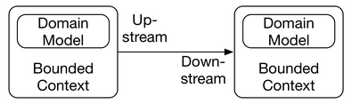
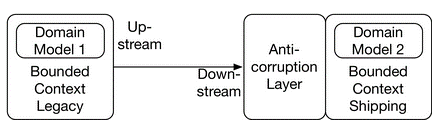
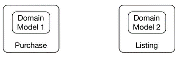
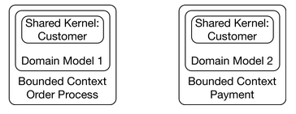
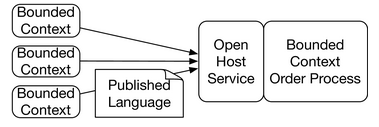

### Strategic design
The division of the system into different bounded contexts is part of strategic design, which belongs to the practices of DDD.
The drawing above shows the fundamental terms of strategic design.

<figure markdown>
{ width=600 height=400 align=center }
<figcaption>Bounded Context</figcaption>
</figure>

`Upstream: means making an influence`

- [x] The bounded context is the context in which a **specific domain model** is valid.
- [x] The bounded contexts depend on each other. Usually, **each bounded context is implemented by one team**.
- [x] **The upstream team can influence the success of the downstream team. However, the downstream team cannot influence the success of the upstream team.**
    For example, the success of the team responsible for payment depends on the order process team.
    If data such as prices or credit card numbers are not part of the order, it is impossible to do the payment.
    However, the order process does not depend on the payment to be successful.
    **Therefore, order processing is upstream. It can make payment fail. Payment is downstream since it cannot make the order process fail.**

## The customer/supplier pattern

With this customer/supplier pattern, the supplier is upstream and the customer is downstream. However, the customer can factor their priorities into the planning of the upstream project.

`Example`
In the drawing below, for example, payment uses the model of the order process. However, payment defines requirements for the order process. Payment can only be done successfully if the order process provides the required data.

So, payment can become a customer of the order process. That way the customer’s requirements can be included in the planning of the order process.

## The conformist pattern

**Conformist means that a bounded context simply uses a domain model from another bounded context.**

`Example`
In the drawing below, the bounded contexts, statistics, and order process, both use the same domain model. The statistics are part of a data warehouse. They use the domain model of the order process bounded context and extract some information relevant to store in the data warehouse.

However, with the conformist pattern, the data warehouse team does not have a say in case of changes to the bounded context.

The data warehouse team could not demand additional information from the other bounded context. However, it is still possible that they would receive additional information out of altruism. Essentially, the data warehouse team is not deemed important enough to get a more powerful role.

<figure markdown>
{ width=600 height=400 align=center }
<figcaption>Conformist: Domain Model Used in Other Bounded Context</figcaption>
</figure>

## The anti-corruption layer
In the case of an anti-corruption layer (ACL) pattern, the bounded context does not directly use the domain model of the other bounded context, but it contains a layer for decoupling its own domain model from the model of the bounded context.

This is useful in conjunction with the conformist pattern to generate a separate model decoupled from the other model.

`Example`

The drawing below shows that the bounded context shipping uses an ACL at the interface to the bounded context legacy so that both bounded contexts have their own independent domain models.

This ensures that the model in the legacy system does not affect the bounded context shipping. Shipping can implement a clean model in its bounded context.

<figure markdown>
{ width=600 height=400 align=center }
<figcaption>ACl</figcaption>
</figure>

## The separate ways pattern
With the separate ways pattern, the bounded contexts are not related at the software level although a relation would be conceivable.

`Example`

Let’s assume that in the e-commerce scenario, a new bounded context, purchasing, for the purchase department is added. This bounded context could collect the data for listing products, but it is implemented differently.

With the separate ways pattern, the purchasing would be separate from the remaining system. When the goods are delivered, a user would use another bounded context like listing to enter the necessary data and list the products.

The purchasing causes the shipping, which in turn triggers the delivery, and thereby triggers the user to list the product with a different bounded context.

`purchasing → shipping → delivery → list product`

The shipping of the products is one event in the real world, however, in the software, the systems are separate.

Consequently, the systems are independent and can be evolved completely independently.

<figure markdown>
{ width=600 height=400 align=center }
<figcaption>Seperate</figcaption>
</figure>

## The shared kernel pattern
The Shared Kernel Pattern describes a common core that is shared by multiple bounded contexts.
The data of a customer is an example of such a scenario.

However, **the shared kernel comprises shared business logic and shared database schema and therefore should not be used in a microservices environment.**

**It is an anti-pattern for microservices systems.** But because DDD can also be applied to deployment monoliths, there are still scenarios in which a shared kernel makes sense.
`Example`

In the drawing below the domain model order process and the payment possess a shared kernel.

<figure markdown>
{ width=600 height=400 align=center }
<figcaption>Shared-kernel</figcaption>
</figure>

## The open host service pattern

Open host service means that the bounded context offers a generic interface with several services. Other bounded contexts can implement their own integration with these services. This pattern is frequently found at public APIs on the Internet. However, it is also a possible alternative within an enterprise.

### The published language model

Published language is a domain model accessible by all bounded contexts. For example, this can be a standard format such as #EDIFACT for transactions between companies. But it is also possible to define a data structure that is only used inside a company and published, for example, in Wiki.

`Example`

These models can be used together. The open host service can use published language for communication. For example, **the order process might accept orders from external clients.** Providing a specific interface for each external client is a lot of effort, so there is a generic open host service and a published language for orders. Each external client can use this interface to submit orders to the bounded context order process.

<figure markdown>
{ width=600 height=400 align=center }
<figcaption>Open Host Service and Published Language</figcaption>
</figure>

## Selecting patterns

The choice of patterns has to be in line with:

- [x] The domain
- [x] The power structures
- [x] The communication relationships between the teams.

`Example`

When the bounded context payment does not obtain the necessary data from the bounded context order processing, the products can be ordered but not paid for. Therefore, the customer/supplier pattern is an obvious choice.

However, this is not a fact found in the domain, but rather a consequence of the power structure, which in turn depends on the company business model.
Tradeoffs to Consider

Of course, the selected patterns influence the effort necessary for coordination and therefore the degree of isolation between the teams. They set the rules by which the teams must work on the integration.

Thus, **a pattern like customer/supplier is not desirable as it requires a lot of coordination**. Still, it might be the right solution depending on domain aspects.

It makes little sense to use a different pattern between payment and the order process just to have less coordination. A different pattern might make it impossible for the business to succeed.

`Good Question`
How to pass configuration patterns to a microservice MUST be a decision of the individual microservice.
`Answer`
False