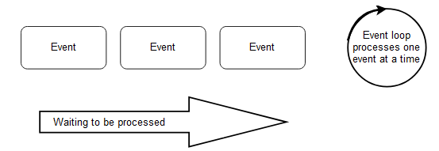

# Reactive programming

One way to implement a microservice is reactive programming. Oftentimes it is stated that microservices must be implemented with reactive technologies.

This section discusses what reactive actually is and determines whether reactive technologies are truly needed for microservices.

Similar to microservices, reactive has an ambiguous definition.

The Reactive Manifesto defines the term “reactive” based on the following characteristics:

## Features

### Responsive

Responsive means that the system responds as fast as possible.

### Resilient

Because of resilience the system remains available even if parts fail.

### Elastic

The system can deal with different levels of load, for instance by using additional resources. After the load peak subsides the resources are freed again.

### Asynchronous communication

The system uses asynchronous communication (message-driven).

These characteristics are useful for microservices. They pretty much correspond to the features discussed in chapter 2 as essential characteristics of microservices.

At first sight, it seems that microservices, in fact, must be written with reactive technologies.

## Reactive programming

However, reactive programming means something completely different. This programming concept resembles the data flow. When new data comes into the system, it is processed. A spreadsheet is an example. When the user changes a value in a cell, the spreadsheet recalculates all dependent cells.

## Classical server applications

A similar approach is possible for server applications. Without reactive programming, a server application typically processes an incoming request in a thread.

If the processing of the request requires a call to a database, the thread blocks until the result of this call arrives.

In this model, a thread has to be provided for each request that is processed in parallel and for each network connection.

## Reactive server applications

Reactive server applications behave very differently. The application only reacts to events. It must not block because it is waiting, for instance, for I/O. Thus, an application waits for an event such as an incoming HTTP request.

If a request arrives, the application executes the logic and then sends a call to the database at some point. However, subsequently, the application does not wait for the result of the call to the database but suspends processing the HTTP request.

Eventually, the next event arrives, namely the result of the call to the database. The processing of the HTTP request then resumes. In this model, only one thread is needed. It processes the respective current event.

The figure below shows an overview of this approach.

<figure markdown>
{ width=600 height=400 align=center }
<figcaption>Reactive-Event Loop</figcaption>
</figure>

The event loop is a thread and processes one event at a time. Instead of waiting for I/O, the processing of the event is suspended.

Once the results of the I/O operation are available, they are part of a new event which is processed by the event loop.

In this way, a single event loop can process a plethora of network connections. However, processing of the event must not block the event loop for longer unless it is absolutely necessary. Otherwise processing of all events will be stopped.

## Reactive programming and the reactive manifesto

Reactive programming can support the goals of the Reactive Manifesto:

- [x] Responsive: The model can make the application respond faster because fewer threads are blocked. However, whether this really leads to an advantage over a classical application depends on how efficiently the threads are implemented in the system and how efficiently it handles blocked threads.
- [x] Resilience: If a service no longer responds, nothing is blocked in reactive programming. This helps with resilience. However, for example, in a classical application, a timeout can avoid a blockage by aborting the processing of the request.
- [x] Elastic: With a higher load, more and more instances can be started. This is also possible with the classical programming model.
- [x] Message-driven: Reactive programming does not affect the communication between the services. Therefore, communication can or cannot be message-driven in reactive programming as well as in classical applications.

### Reactive programming is not necessary for microservices

The Reactive Manifesto is certainly relevant for microservices. But a microservice does not have to be implemented with reactive programming in order to achieve the goals of the Reactive Manifesto.

Whether or not a microservice is implemented with reactive programming can be different for each microservice.

This can be a micro architecture decision and therefore affects only individual microservices, but not the system as a whole.

It is important to understand the difference, because otherwise the choice of technologies might be limited to reactive programming frameworks even though that is not necessary.

It is perfectly fine to stay with established technologies. In fact, using a technology stack that you are used to might be easier and bring faster results.

At the same time, it is possible to try new technologies like reactive programming in one microservice and then use it in other microservices if it has proven to be useful.