## Domain-Driven Design (DDD)(Java)

<figure markdown>
{ width=800 height=600 align=center }
<figcaption>Transfer analysis from event storming perspective</figcaption>
</figure>

<figure markdown>
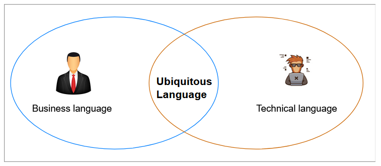{ width=800 height=600 align=center }
<figcaption>Ubiquitous language</figcaption>
</figure>

<figure markdown>
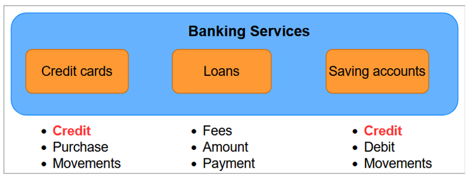{ width=800 height=600 align=center }
<figcaption>A similar word in different subdomains</figcaption>
</figure>

<figure markdown>
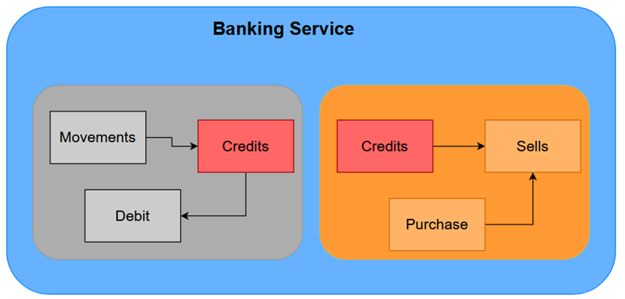{ width=800 height=600 align=center }
<figcaption>Bounded context and their models</figcaption>
</figure>

<figure markdown>
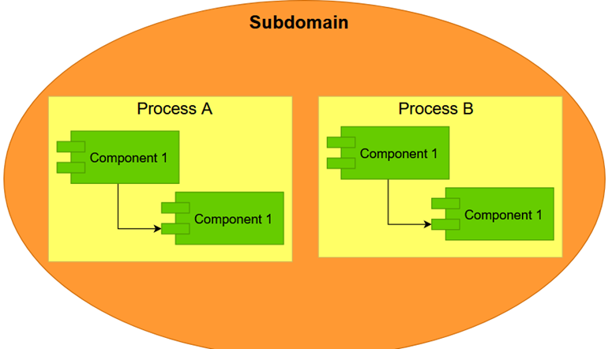{ width=800 height=600 align=center }
<figcaption>Bounded contexts are the solution space</figcaption>
</figure>

<figure markdown>
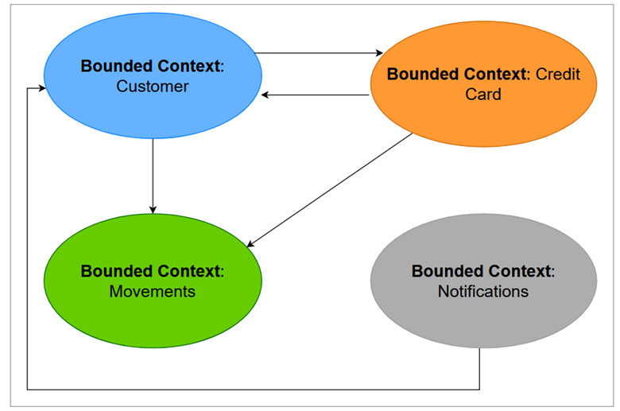{ width=800 height=600 align=center }
<figcaption>Relationships between bounded contexts</figcaption>
</figure>

<figure markdown>
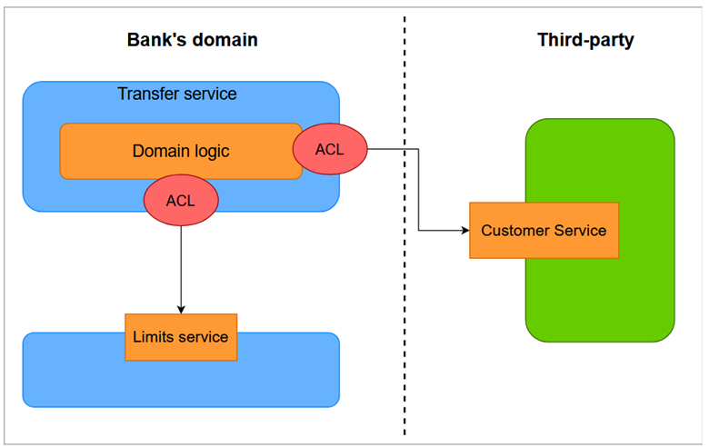{ width=800 height=600 align=center }
<figcaption>Interacting with external services through ACL</figcaption>
</figure>

<figure markdown>
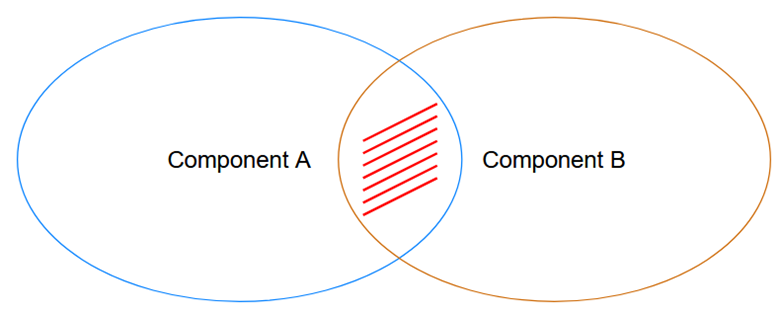{ width=600 height=400 align=center }
<figcaption>Common functionalities between components/ microservice</figcaption>
</figure>

<figure markdown>
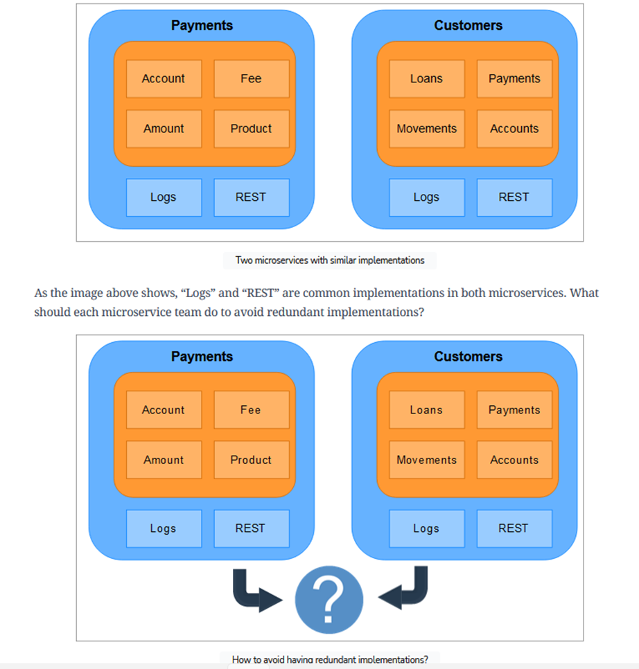{ width=800 height=600 align=center }
<figcaption>Microservice</figcaption>
</figure>

<figure markdown>
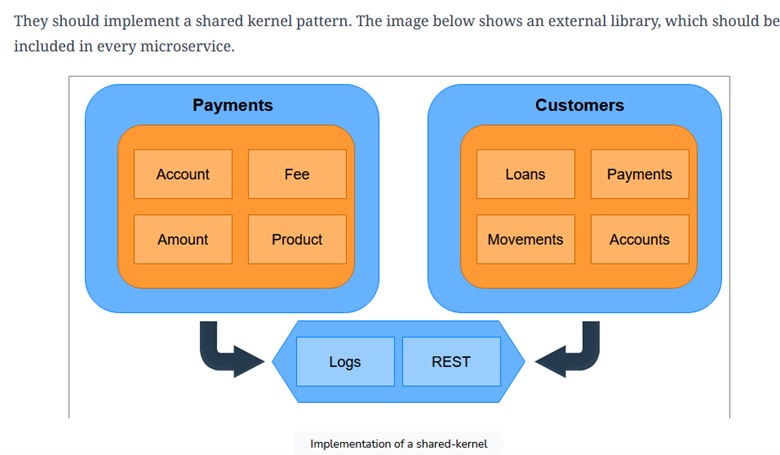{ width=800 height=600 align=center }
<figcaption>Microservice</figcaption>
</figure>

<figure markdown>
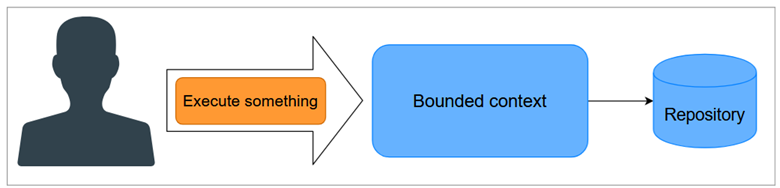{ width=800 height=600 align=center }
<figcaption>Executing a command in a bounded context</figcaption>
</figure>

<figure markdown>
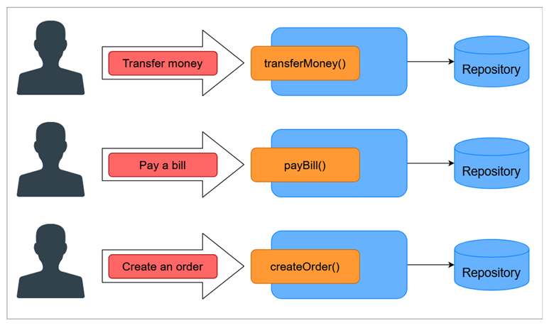{ width=800 height=600 align=center }
<figcaption>Commands and ubiquitous language</figcaption>
</figure>

<figure markdown>
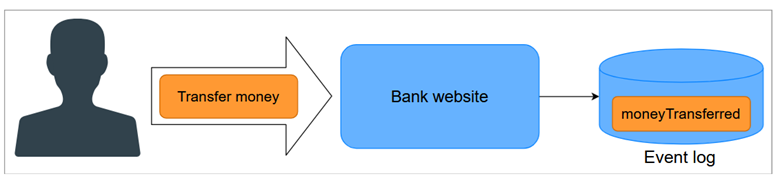{ width=800 height=600 align=center }
<figcaption>Event created after execution of request</figcaption>
</figure>

<figure markdown>
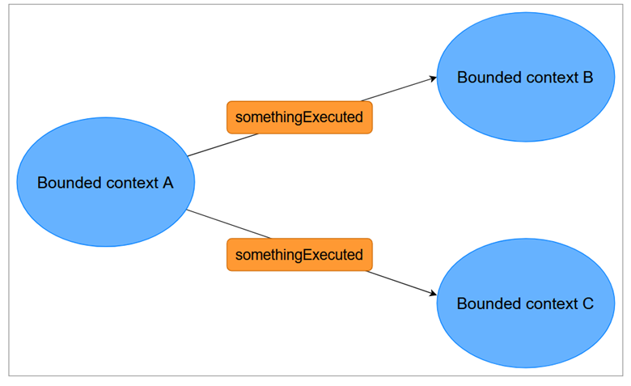{ width=800 height=600 align=center }
<figcaption>Sharing domain events between bounded contexts</figcaption>
</figure>

<figure markdown>
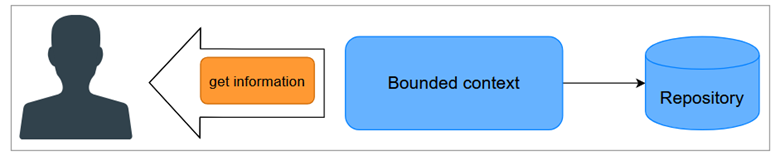{ width=800 height=600 align=center }
<figcaption>Query executed in a bounded context</figcaption>
</figure>

<figure markdown>
{ width=800 height=600 align=center }
<figcaption>Response queries change when changing state in between</figcaption>
</figure>

<figure markdown>
{ width=800 height=600 align=center }
<figcaption>Ubiquitous language in query handlers</figcaption>
</figure>

<figure markdown>
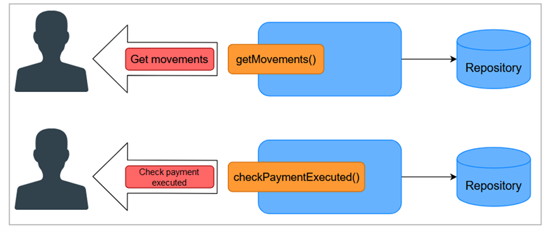{ width=800 height=600 align=center }
<figcaption>Ubiquitous language in query handlers</figcaption>
</figure>


Beyond the Model Driven Design (MDD) methodology, the Object Management Group (OMG) created a conceptual framework called Model Driven Architecture (MDA) .
1.	Computation Independent Model (CIM): This model focuses on the domain model.
2.	Platform Independent Model (PIM): This model focuses on a general platform, where a solution is deployed.
3.	Platform Specific Model (PSM): This model focuses on a specific platform, where a solution is deployed.

There are three possible domain objects for the implementation of business logic: entities, value objects, and aggregates.

### Entity 
Account, Credit Card, Customer, or Transaction. An entity shows well-defined attributes and domain behavior. ID or a key, which implies that attribute values may change when required. This is why this domain object is mutable. The identification of an object is not affected when attribute values change.
`The characteristics of an entity`
Entities must meet the following characteristics to be well-defined:
- [x] Each needs a unique identifier. An entity should be defined within a specific bounded context.
- [x] They should be meaningful only in one bounded context.
- [x] They should not use setter methods.
- [x] They may use getter methods, when necessary.
- [x] If some logic is required, value objects can acquire it.
- [x] A constructor should be the only way to create an entity.

<figure markdown>
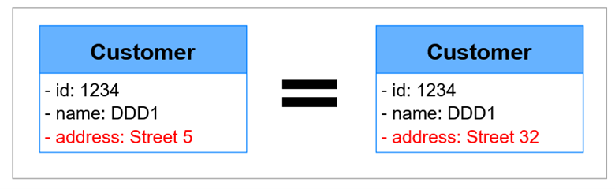{ width=800 height=600 align=center }
<figcaption>Two similar entities</figcaption>
</figure>

<figure markdown>
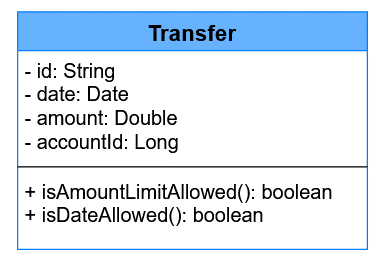{ width=800 height=600 align=center }
<figcaption>Entity Transfer</figcaption>
</figure>

<figure markdown>
{ width=800 height=600 align=center }
<figcaption>Entity Transfer</figcaption>
</figure>

```java
import java.util.Date;

public class Main{

    public static void main(String[] args){
        Transfer transfer = new Transfer("1234", new Date(), 12000.7, 44354363L);

        System.out.println("*** Amount limit validation ***");
        // Validate amount
        if(transfer.isAmountLimitAllowed()){
            System.out.println("Amount is allowed");
        }else{
            System.out.println("Amount is not allowed");
        }

        System.out.println("\n *** Date validation ***");
        // Validate date
        if(transfer.isDateAllowed()){
            System.out.println("Date is allowed");
        }else{
            System.out.println("Date is not allowed");
        }
    }
}
```

### Value Objects
Eric Evans book on DDD, describes what a value object is from the real-world perspective:
“When a child is drawing, he cares about the color of the marker he chooses, and he may care about the sharpness of the tip. But if there are two markers of the same color and shape, he probably won’t care which one he uses. If a marker is lost and replaced by another of the same color from a new pack, he can resume his work unconcerned about the switch.” 
`Characteristics of a value object`
Value objects should meet the following characteristics to be well-defined:
- [x] These objects are immutable. Some common examples of value objects are Address, emailAddress, Amount, and so on.
- [x] that value objects do not have an ID, and they are identifiable only by their set of attributes.
- [x] They should be defined within a specific bounded context.
- [x] A value object in one bounded context may be an entity.
- [x] They should be meaningful only in one bounded context.
- [x] They should have any logic that is required for their use.
- [x] They should not use setter methods.
- [x] They may use getter methods, when necessary.
- [x] A constructor should be the only way to create a value object.

<figure markdown>
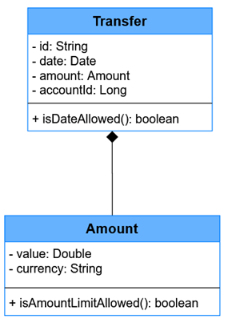{ width=800 height=600 align=center }
<figcaption>Value object of amount</figcaption>
</figure>


```java
// Amount is the value objects that has information and logic related to an amount
public class Amount {

    // Attributes of an amount value object
    private Double value;
    private String currency;

    // Amount is the only way to create an Amount value object
    public Amount(Double value, String currency){
        this.value = value;
        this.currency = currency;
    }

    // isAmountLimitAllowed checks whether amount to transfer does not got beyond the bank limits
    public boolean isAmountLimitAllowed(){
        if(this.value >= 10000)
            return false;
        return true;
    }
}

///

import java.util.Date;

// Transfer is the entity that has information and logic related to a transfer
public class Transfer {

    // Attributes of a transfer entity
    private String id;
    private Date date;
    private Amount amount;
    private Long accountId;

    // Transfer is the only way to create a transfer entity
    public Transfer(String id,Date date, Double amount, String currency, Long accountId){
        this.id = id;
        this.date = date;
        this.amount = new Amount(amount,currency);
        this.accountId = accountId;
    }

    // isDateAllowed checks whether transfer is executed in the current day
    public boolean isDateAllowed(){
        Date now = new Date();
        if(this.date.after(now)){
            return false;
        }
        return true;
    }

    public boolean isAmountLimitAllowed(){
        return this.amount.isAmountLimitAllowed();
    }
}
import java.util.Date;

public class Main{

    public static void main(String[] args){
        Transfer transfer = new Transfer("1234", new Date(), 12000.7,"USD", 44354363L);

        // Validate amount
        if(transfer.isAmountLimitAllowed()){
            System.out.println("Amount is allowed");
        }else{
            System.out.println("Amount is not allowed");
        }

        // Validate date
        if(transfer.isDateAllowed()){
            System.out.println("Date is allowed");
        }else{
            System.out.println("Date is not allowed");
        }
    }
}
```

### Aggregate
It might be necessary to create a huge number of entities and value objects and facilitate interactions between them, when we deal with a complex bounded context. An aggregate object is a cluster of entities and value objects that are treated as a single unit from the domain and data perspective. This object acts as a load balancer for accessing a set of nodes. This means that an aggregate is the only access point for external objects. As the image below shows, an aggregate has clear bounds and the artifacts inside it cannot interact with the outside world. Therefore, an aggregate should expose a type of interface that allows external objects to reach the functionalities inside it.


<figure markdown>
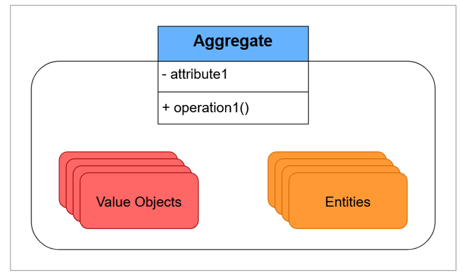{ width=800 height=600 align=center }
<figcaption>Aggregate and its objects</figcaption>
</figure>

<figure markdown>
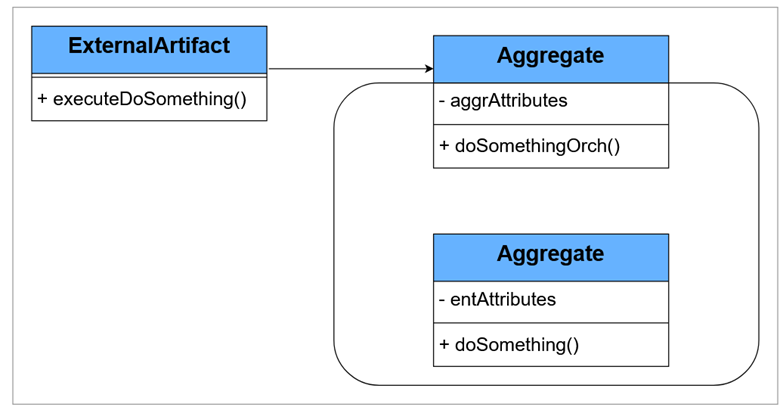{ width=800 height=600 align=center }
<figcaption>Object invokes some aggregate internal logic</figcaption>
</figure>

In this case, an aggregate called Transaction is introduced to put objects together.

```json
{
    "eventId" : "1ce5608e-c76c-4412-8bd1-a2c6ed42970d",
    "eventType" : "Transfers",
    "eventName": "moneyTransfered",
    "timestamp" : "1628360557000",
    "data" : {
        "transaction":{
            "id": "1ce5608e-c76c-4412-8bd1-a2c6ed42970d",
            "bankName": "Bank test",
            "amount":{
                "value": 76567.78,
                "Currency": "USD"
            },
            "transfer":{
                "id": "1ce5608e-c76c-4412-8bd1-a2c6ed42970d",
                "date": "2021-08-07T17:10:43+00:00",
                "accountId": "09876543"
            }
        }
    }
  }
```

<figure markdown>
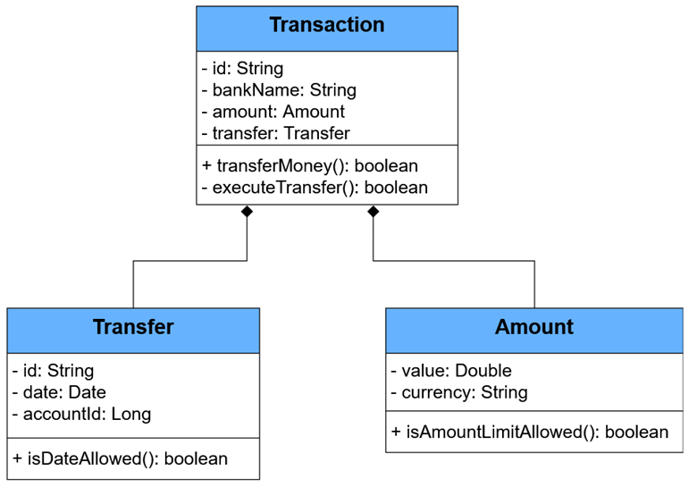{ width=800 height=600 align=center }
<figcaption>Aggregate transaction contains Transfer and Amount artifacts</figcaption>
</figure>

```java
import java.util.Date;

public class Main{

    public static void main(String[] args){
        Transaction transfer = new Transaction("123", "Educative bank", 23453.98, "USD", new Date(), 453646L);

        System.out.println("**** Before executing a transfer ****");

        // Transfer money, it validates business rules
        if(transfer.transferMoney()){
            System.out.println("Transfer is done");
        }else{
            System.out.println("Transfer is not done");
        }
    }
}
// Amount is the value objects that has information and logic related to an amount
public class Amount {

    // Attributes of an amount value object
    private Double value;
    private String currency;

    // Amount is the only way to create an Amount value object
    public Amount(Double value, String currency){
        this.value = value;
        this.currency = currency;
    }

    // isAmountLimitAllowed checks whether amount to transfer does not got beyond the bank limits
    public boolean isAmountLimitAllowed(){
        if(this.value >= 10000)
            return false;
        return true;
    }
}
import java.util.Date;

// Transfer is the entity that has information and logic related to a transfer
public class Transfer {

    // Attributes of a transfer entity
    private String id;
    private Date date;
    private Long accountId;

    // Transfer is the only way to create a transfer entity
    public Transfer(String id,Date date, Long accountId){
        this.id = id;
        this.date = date;
        this.accountId = accountId;
    }

    // isDateAllowed checks whether transfer is executed in the current day
    public boolean isDateAllowed(){
        Date now = new Date();
        if(this.date.after(now)){
            return false;
        }
        return true;
    }
}
import java.util.Date;

// Transaction is the aggregate, it contains Transfer and Amount artifacts
public class Transaction {

    // Attributes of a transaction aggregate
    private String id;
    private String bankName;
    private Amount amount;
    private Transfer transfer;

    // Transaction is the only way to create a transaction object and its entities and value objects
    public Transaction(String id, String bankName, Double amount, String currency, Date date, Long accountId) {
        this.id = id;
        this.bankName = bankName;
        this.amount = new Amount(amount,currency);
        this.transfer = new Transfer(id,date,accountId);
    }

    // TransferMoney validates date and limit before executing a transfer.
    // Date and limit validation is based on transfer and amount artifacts
    public boolean transferMoney(){
        if(!this.transfer.isDateAllowed())
            return false;

        if(!this.amount.isAmountLimitAllowed())
            return false;

        return this.executeTransfer();

    }

    // isDateAllowed checks whether transfer is executed in the current day
    private boolean executeTransfer(){
        // here is where transfer logic should be placed
        return true;
    }
}
```

### Aggregate Root
an aggregate root is a cluster of objects with entities, values, or even other aggregates. The main difference between them is that an aggregate root is the main aggregate, while a simple aggregate is not the main aggregate. This means that everything outside of the domain layer boundary must use business logic, through interaction with the aggregate root. The aggregate root should, in turn, orchestrate logic in other aggregates, value objects, and entities.


<figure markdown>
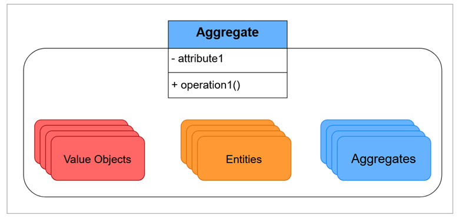{ width=800 height=600 align=center }
<figcaption>Aggregate root</figcaption>
</figure>

<figure markdown>
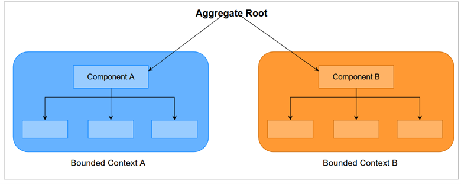{ width=800 height=600 align=center }
<figcaption>Different aggregate roots</figcaption>
</figure>

It is important to consider the following questions: 
1.	If the entity is deleted, is it necessary to delete the other entities?
2.	Does a single transaction span across multiple entities and value objects?
3.	Is the entity involved in multiple functionalities inside the same aggregate root?
4.	Does the entity execute more functionalities than other entities?

<figure markdown>
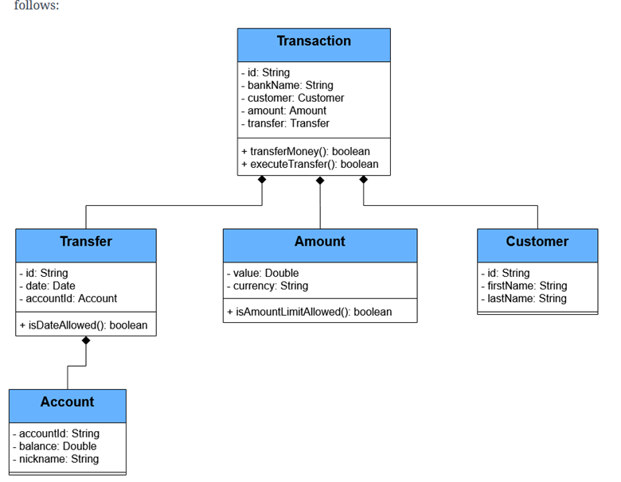{ width=800 height=600 align=center }
<figcaption>Aggregate root of transfer</figcaption>
</figure>

```json
{
    "eventId": "1ce5608e-c76c-4412-8bd1-a2c6ed42970d",
    "eventType": "Transfers",
    "eventName": "moneyTransfered",
    "timestamp": "1628360557000",
    "data": {
        "transaction": {
            "id": "1ce5608e-c76c-4412-8bd1-a2c6ed42970d",
            "bankName": "Bank test",
            "customer": {
                "id": "8867g87m",
                "firstName": "DDD",
                "lastName": "test"
            },
            "amount": {
                "value": 76567.78,
                "Currency": "USD"
            },
            "transfer": {
                "id": "1ce5608e-c76c-4412-8bd1-a2c6ed42970d",
                "date": "2021-08-07T17:10:43+00:00",
                "account": {
                    "accountId": "0098976",
                    "balance": 7675.9,
                    "nickname": "test-account"
                }
            }
        }
    }
}
```

Program:

```java
import java.util.Date;

public class Main{

    public static void main(String[] args){
        Transaction transfer = new Transaction("123", "Educative bank", 23453.98, "USD", new Date(), 453646, 98765);

        System.out.println("**** Before executing a transfer ****");

        // Transfer money, it validates business rules
        if(transfer.transferMoney()){
            System.out.println("Transfer is done");
        }else{
            System.out.println("Transfer is not done");
        }
    }
}
// Customer is the entity that has information and logic related to a customer
public class Customer {

    // Attributes of a customer entity
    private Integer id;
    private String firstName;
    private String lastName;

    // Customer is the only way to create an account entity
    public Customer(Integer id) {
        this.id = id;
    }
}
// Account is the entity that has information and logic related to an account
public class Account {

    // Attributes of an account entity
    private Integer accountId;
    private Double balance;
    private String nickname;

    // Account is the only way to create an account entity
    public Account(Integer accountId){
        this.accountId = accountId;
    }
}
import java.util.Date;

// Transfer is the aggregate that has information and logic related to a transfer
public class Transfer {

    // Attributes of a transfer aggregate
    private String id;
    private Date date;
    private Account accountId;

    // Transfer is the only way to create a transfer aggregate
    public Transfer(String id,Date date, Integer accountId){
        this.id = id;
        this.date = date;
        this.accountId = new Account(accountId);
    }

    // isDateAllowed checks whether transfer is executed in the current day
    public boolean isDateAllowed(){
        Date now = new Date();
        if(this.date.after(now)){
            return false;
        }
        return true;
    }
}
// Amount is the value objects that has information and logic related to an amount
public class Amount {

    // Attributes of an amount value object
    private Double value;
    private String currency;

    // Amount is the only way to create an Amount value object
    public Amount(Double value, String currency){
        this.value = value;
        this.currency = currency;
    }

    // isAmountLimitAllowed checks whether amount to transfer does not got beyond the bank limits
    public boolean isAmountLimitAllowed(){
        if(this.value >= 10000)
            return false;
        return true;
    }
}
import java.util.Date;

// Transaction is the aggregate, it contains Transfer and Amount artifacts
public class Transaction {

    // Attributes of a transaction aggregate
    private String id;
    private String bankName;
    private Customer customer;
    private Amount amount;
    private Transfer transfer;

    // Transaction is the only way to create a transaction object and its entities and value objects
    public Transaction(String id, String bankName, Double amount, String currency, Date date, Integer accountId, Integer customerId) {
        this.id = id;
        this.bankName = bankName;
        this.customer = new Customer(customerId);
        this.amount = new Amount(amount,currency);
        this.transfer = new Transfer(id,date,accountId);
    }

    // TransferMoney validates date and limit before executing a transfer.
    // Date and limit validation is based on transfer and amount artifacts
    public boolean transferMoney(){
        if(!this.transfer.isDateAllowed())
            return false;

        if(!this.amount.isAmountLimitAllowed())
            return false;

        return this.executeTransfer();

    }

    // isDateAllowed checks whether transfer is executed in the current day
    private boolean executeTransfer(){
        // here is where transfer logic should be placed
        return true;
    }
}
```

### Repository
A repository is a pattern, which isolates business logic from data-store-interaction logic. It functions as a collection of objects in memory. it invokes functions in a repository. It only knows a group of objects in memory. It is unaware of what lies behind such a repository.

<figure markdown>
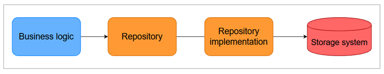{ width=800 height=600 align=center }
<figcaption>Repository</figcaption>
</figure>

<figure markdown>
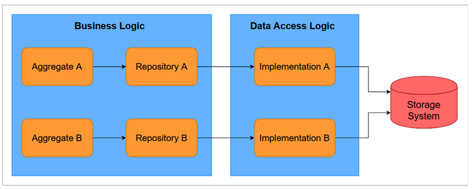{ width=800 height=600 align=center }
<figcaption>Every aggregate has its repository</figcaption>
</figure>

A repository interface should only expose business-logic behavior. Functions and their attributes should be named in relation to their domain behavior. As the image below shows, the function, getAccount(Account), is named in non-technical terms and receives the artifact account. On the other hand, the wrong definition defines a technical function, getAccountById(id), and receives an ID.

<figure markdown>
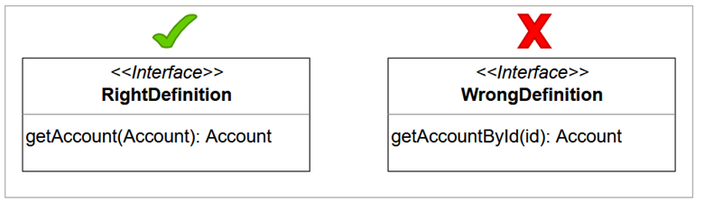{ width=800 height=600 align=center }
<figcaption>Business name vs. technical name</figcaption>
</figure>

Persistence operations should be atomic. If the user needs to store a new state of a domain, it should be guaranteed as every stored aggregate acquires a new state. This behavior is depicted in the image shown below.

<figure markdown>
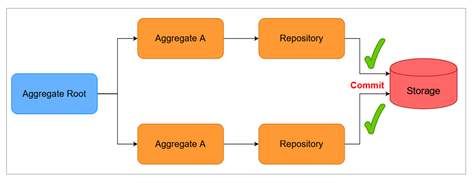{ width=800 height=600 align=center }
<figcaption>Atomicity in a transaction between different aggregates</figcaption>
</figure>

#### Benefits of repositories

The implementation of repositories give us the following benefits:
- [x] It helps in the isolation of the domain model from the storage layer. It enables us to change storage technology, without affecting the business logic.
- [x] It gives us a flexible way to implement unit tests, as it is possible to use a mock-storage system.
- [x] It promotes the separation of concerns among the domain layer and the data-access layer.

#### Drawbacks of repositories
It is important to consider the following drawbacks when repositories are implemented:
- [x] It is possible to experience some performance problems when the aggregate is large. Multiple database operations may be required to store or receive objects in a large aggregate.
- [x] Repositories may lead to criteria-based query problems. As was previously mentioned, functions in a repository should be defined with business terms. When a specific inquiry is required, this implementation may be complicated.

<figure markdown>
{ width=800 height=600 align=center }
<figcaption>Aggregate root of transfer</figcaption>
</figure>

```java
import java.util.Date;


public class Main{

    // main is the start point
    public static void main(String[] args){
        Sells sells = new Sells(new ProductRepositoryImplementation());

        System.out.println("List of products:");
        for(Product product: sells.ListProducts()){
            System.out.println(product.getId() + " - " + product.getName() + " - " + product.getPrice().toString());
        }        
    }
}
// Product is an entity
public class Product {

    // Attributes of a product
    private String id;
    private Double price;
    private String name;

    // Product is the only way to create a product object
    public Product(String id, Double price, String name) {
        this.id = id;
        this.price = price;
        this.name = name;
    }

    public String getId() {
        return id;
    }

    public Double getPrice() {
        return price;
    }

    public String getName() {
        return name;
    }
}
import java.util.List;

// Sells is an aggregate root
public class Sells {

    // Attributes of Sells
    private Product product;
    private ProductRepository repository;

    // Sells is the only way to create a sells object
    public Sells(ProductRepository repository){
        this.repository = repository;
    }

    // ListProducts returns all products that are in a repository
    public List<Product> ListProducts(){
        return this.repository.GetAllProducts();
    }
}
import java.util.List;

// ProductRepository defines all functionalities in a repository
public interface ProductRepository {

    // GetAllProducts allows to search for all products
    public List<Product> GetAllProducts();
}
import java.util.ArrayList;
import java.util.List;

// ProductRepositoryImplementation is the implementation of the repository
public class ProductRepositoryImplementation implements ProductRepository{

    @Override
    public List<Product> GetAllProducts() {
        List<Product> products = new ArrayList<>();
        for(int i=0; i< 10; i++){
            products.add(new Product(String.valueOf(i),5644.8,"Product # " + i));
        }
        return products;
    }
}
import java.util.ArrayList;
import java.util.List;

// ProductRepositoryImplementation is the implementation of the repository
public class ProductRepositoryImplementation implements ProductRepository{

    @Override
    public List<Product> GetAllProducts() {
        List<Product> products = new ArrayList<>();
        for(int i=0; i< 10; i++){
            products.add(new Product(String.valueOf(i),5644.8,"Product # " + i));
        }
        return products;
    }
}
```

### Factory
factory is a tactical pattern used in the DDD world. It helps us create complex objects. It is important to keep in mind that we should only implement this pattern when the instantiation of an object is complex. e.g., To build an Account entity is necessary to load information from external sources, validate the customer information. Interacting with those objects is what adds complexity to objects’ creation. To deal with this situation, DDD suggests that we implement a factory.

In the context of DDD, the use of a factory pattern is not required to implement the factory design pattern. It is possible to implement any design pattern, such as a Builder or even a custom implementation. The only thing necessary for the factory design pattern to isolate business logic from the creation of complex objects.

A factory should only be present inside the aggregate root, as this is the object that orchestrates all of the business logic.

<figure markdown>
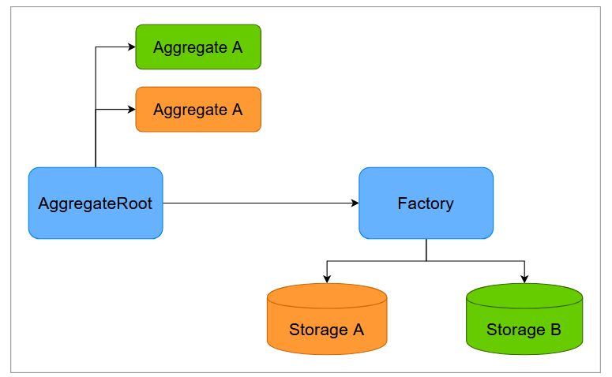{ width=800 height=600 align=center }
<figcaption>Factory interacting with an aggregate root and repositories</figcaption>
</figure>

`When is it appropriate to implement a factory?`
As was mentioned before, a factory is not always the best solution. However, it is a suitable approach when:
- [x] Business logic requires the instantiation of many objects. Perhaps, in this context, a factory pattern is required to look for information in some external systems.
- [x] The aggregate root input data is extensive and variable. We can use the data in different use cases. In this scenario, a builder pattern would make perfect sense.
- [x] The aggregates, entities, or value objects that need to be instantiated vary in accordance with the use case.
- [x] It is necessary to translate one bounded context into another.

<figure markdown>
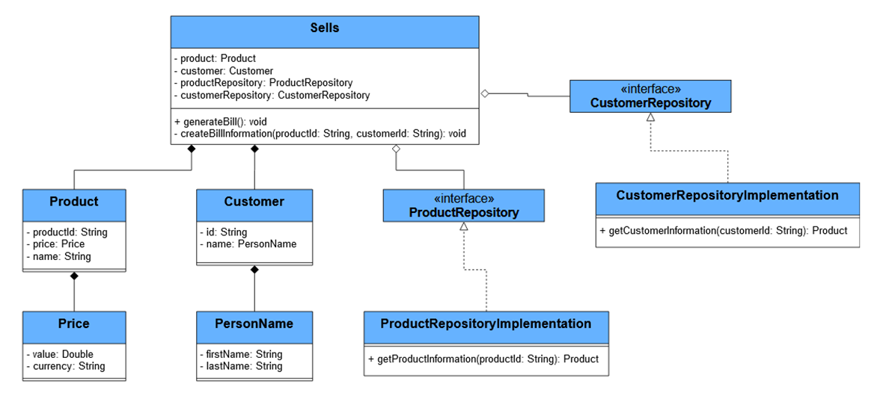{ width=800 height=600 align=center }
<figcaption>Factory model</figcaption>
</figure>

When the Sells object is instantiated, it creates all of the dependencies it needs to execute its work. To test it, a main method creates a Sell object and executes the GenerateBill() method. This will print all of the information related to a bill.

```java
import java.util.Date;

public class Main{

    // main is the start point
    public static void main(String[] args){
        Sells sells = new Sells("123","987", 
            new ProductRepositoryImplementation(),
            new CustomerRepositoryImplementation());
        
        System.out.println("Information about a bill: ");
        sells.generateBill();
    }
}
// Product is an aggregate
public class Product {

    // Attributes of a product
    private String id;
    private Price price;
    private String name;

    // Product is the only way to create a product object
    public Product(String id, Double price, String name) {
        this.id = id;
        this.price = new Price(price,"USD");
        this.name = name;
    }

    public String getId() {
        return id;
    }

    public Price getPrice() {
        return price;
    }

    public String getName() {
        return name;
    }
}
// PersonName is a value object
public class PersonName {

    // Attributes of personName
    private String firstName;
    private String lastName;

    // PersonName is the only way to create a personName object
    public PersonName(String firstName, String lastName) {
        this.firstName = firstName;
        this.lastName = lastName;
    }

    public String getFirstName() {
        return firstName;
    }

    public String getLastName() {
        return lastName;
    }
}
// Customer is an aggregate
public class Customer {

    // Attributes of customer
    private String customerId;
    private PersonName name;

    // Customer is the only way to create a customer object
    public Customer(String customerId, String firstName, String lastName) {
        this.customerId = customerId;
        this.name = new PersonName(firstName,lastName);
    }

    public String getCustomerId() {
        return customerId;
    }

    public PersonName getName() {
        return name;
    }
}
// Price is a value object
public class Price {

    // Attributes of Price
    private Double value;
    private String currency;

    // Price is the only way to create a price object
    public Price(Double value, String currency) {
        this.value = value;
        this.currency = currency;
    }

    public Double getValue() {
        return value;
    }

    public String getCurrency() {
        return currency;
    }
}
// ProductRepository defines all functionalities in a repository
public interface ProductRepository {

    // GetProductInformation allows to search for a particular product
    public Product GetProductInformation(String productId);
}
// ProductRepositoryImplementation is the implementation of the ProductRepository
public class ProductRepositoryImplementation implements ProductRepository {

    @Override
    public Product GetProductInformation(String productId) {
        return new Product(productId,5644.8,"Product # "+ productId);
    }
}
// CustomerRepository defines all functionalities in a repository
public interface CustomerRepository {

    // GetCustomerInformation allows to search for a particular customer
    public Customer GetCustomerInformation(String customerId);
}
// CustomerRepositoryImplementation is the implementation of CustomerRepository
public class CustomerRepositoryImplementation implements CustomerRepository{
    @Override
    public Customer GetCustomerInformation(String customerId) {
        return new Customer(customerId,"DDD","Test");
    }
}
import java.util.List;

// Sells is an aggregate root
public class Sells {

    // Attributes of Sells
    private Product product;
    private Customer customer;
    private ProductRepository productRepository;
    private CustomerRepository customerRepository;

    // Sells is the only way to create a sells object
    public Sells(String productId, String customerId,ProductRepository productRepository, CustomerRepository customerRepository) {
        this.productRepository = productRepository;
        this.customerRepository = customerRepository;
        createBillInformation(productId,customerId);
    }

    // generateBill generates a bill based on the information generated previously
    public void generateBill(){
        System.out.println(String.format("Generating bill for customer %s whose name is %s. The product is %s and its price is %4.2f",
                this.customer.getCustomerId(),
                this.customer.getName().getFirstName(),
                this.product.getId(),
                this.product.getPrice().getValue()));
    }

    // createBillInformation is a custom implementation of an aggregate
    private void createBillInformation(String productId, String customerId){
        this.customer = this.customerRepository.GetCustomerInformation(customerId);
        this.product = this.productRepository.GetProductInformation(productId);
    }
}
```

### Services
However, what happens if the particular logic does not fit into any entity or value object? The answer can be found in the functionality of a service which cannot be modeled naturally in any entity or value object as part of the domain logic.
Domain services are usually implemented when the logic of two or more domain objects is invoked. If service logic needs to interact with an external system, it should be built with the definition of an interface in the domain layer and the implementation of it in another layer.

<figure markdown>
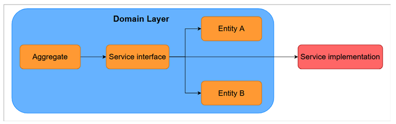{ width=800 height=600 align=center }
<figcaption>Definition and implementation of a domain service</figcaption>
</figure>

#### Characteristics of a domain service
Domain services should meet the following characteristics to be well-defined and isolated from the domain model:
- [x] They should be stateless. They should not maintain information between calls. Once an execution is completed, all of the information related to the execution should disappear.
- [x] They can produce domain events. This may, in turn, cause the execution of other bounded contexts.
- [x] They must be highly cohesive. These objects must execute only one specific task. Since the domain logic contained within domain services does not fit elsewhere, they need to accomplish domain logic through interactions with other business objects. This means that domain objects are aware of value objects and entities.
- [x] They can interact with other domain services and repositories, as required.

<figure markdown>
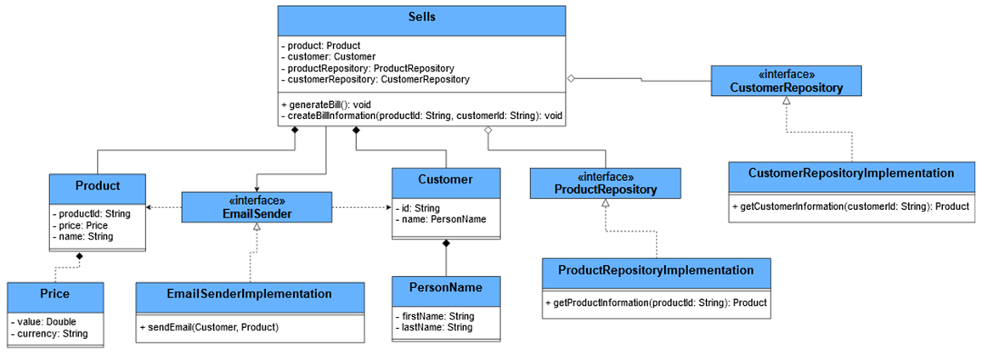{ width=800 height=600 align=center }
<figcaption>Service model</figcaption>
</figure>

```java
// Sells is an aggregate root
public class Sells {

    // Attributes of Sells
    private Product product;
    private Customer customer;
    private ProductRepository productRepository;
    private CustomerRepository customerRepository;

    // Sells is the only way to create a sells object
    public Sells(String productId, String customerId,ProductRepository productRepository, CustomerRepository customerRepository) {
        this.productRepository = productRepository;
        this.customerRepository = customerRepository;
        createBillInformation(productId,customerId);
    }

    // GenerateBill generates a bill based on the information generated previously and sends an email to the customer
    public void generateBill(EmailSender emailImplementation){
        System.out.println(String.format("Generating bill for customer %s whose name is %s. The product is %s and its price is %4.2f",
                this.customer.getCustomerId(),
                this.customer.getName().getFirstName(),
                this.product.getId(),
                this.product.getPrice().getValue()));

        emailImplementation.sendEmail(this.customer,this.product);

    }

    // createBillInformation is a custom implementation of an aggregate
    private void createBillInformation(String productId, String customerId){
        this.customer = this.customerRepository.GetCustomerInformation(customerId);
        this.product = this.productRepository.GetProductInformation(productId);
    }
}
// Customer is an aggregate
public class Customer {

    // Attributes of customer
    private String customerId;
    private PersonName name;
    private String emailAddress;

    // Customer is the only way to create a customer object
    public Customer(String customerId, String firstName, String lastName,String emailAddress) {
        this.customerId = customerId;
        this.name = new PersonName(firstName,lastName);
        this.emailAddress=emailAddress;
    }

    public String getCustomerId() {
        return customerId;
    }

    public PersonName getName() {
        return name;
    }

    public String getEmailAddress(){return emailAddress;}
}
// Sells is an aggregate root
public class Sells {

    // Attributes of Sells
    private Product product;
    private Customer customer;
    private ProductRepository productRepository;
    private CustomerRepository customerRepository;

    // Sells is the only way to create a sells object
    public Sells(String productId, String customerId,ProductRepository productRepository, CustomerRepository customerRepository) {
        this.productRepository = productRepository;
        this.customerRepository = customerRepository;
        createBillInformation(productId,customerId);
    }

    // GenerateBill generates a bill based on the information generated previously and sends an email to the customer
    public void generateBill(EmailSender emailImplementation){
        System.out.println(String.format("Generating bill for customer %s whose name is %s. The product is %s and its price is %4.2f",
                this.customer.getCustomerId(),
                this.customer.getName().getFirstName(),
                this.product.getId(),
                this.product.getPrice().getValue()));

        emailImplementation.sendEmail(this.customer,this.product);

    }

    // createBillInformation is a custom implementation of an aggregate
    private void createBillInformation(String productId, String customerId){
        this.customer = this.customerRepository.GetCustomerInformation(customerId);
        this.product = this.productRepository.GetProductInformation(productId);
    }
}
// Sells is an aggregate root
public class Sells {

    // Attributes of Sells
    private Product product;
    private Customer customer;
    private ProductRepository productRepository;
    private CustomerRepository customerRepository;

    // Sells is the only way to create a sells object
    public Sells(String productId, String customerId,ProductRepository productRepository, CustomerRepository customerRepository) {
        this.productRepository = productRepository;
        this.customerRepository = customerRepository;
        createBillInformation(productId,customerId);
    }

    // GenerateBill generates a bill based on the information generated previously and sends an email to the customer
    public void generateBill(EmailSender emailImplementation){
        System.out.println(String.format("Generating bill for customer %s whose name is %s. The product is %s and its price is %4.2f",
                this.customer.getCustomerId(),
                this.customer.getName().getFirstName(),
                this.product.getId(),
                this.product.getPrice().getValue()));

        emailImplementation.sendEmail(this.customer,this.product);

    }

    // createBillInformation is a custom implementation of an aggregate
    private void createBillInformation(String productId, String customerId){
        this.customer = this.customerRepository.GetCustomerInformation(customerId);
        this.product = this.productRepository.GetProductInformation(productId);
    }
}
// ProductRepositoryImplementation is the implementation of the ProductRepository
public class ProductRepositoryImplementation implements ProductRepository {

    @Override
    public Product GetProductInformation(String productId) {
        return new Product(productId,5644.8,"Product # "+ productId);
    }
}
// ProductRepository defines all functionalities in a repository
public interface ProductRepository {

    // GetProductInformation allows to search for a particular product
    public Product GetProductInformation(String productId);
}
// Product is an aggregate
public class Product {

    // Attributes of a product
    private String id;
    private Price price;
    private String name;

    // Product is the only way to create a product object
    public Product(String id, Double price, String name) {
        this.id = id;
        this.price = new Price(price,"USD");
        this.name = name;
    }

    public String getId() {
        return id;
    }

    public Price getPrice() {
        return price;
    }

    public String getName() {
        return name;
    }
}
// Price is a value object
public class Price {

    // Attributes of Price
    private Double value;
    private String currency;

    // Price is the only way to create a price object
    public Price(Double value, String currency) {
        this.value = value;
        this.currency = currency;
    }

    public Double getValue() {
        return value;
    }

    public String getCurrency() {
        return currency;
    }
}
// PersonName is a value object
public class PersonName {

    // Attributes of personName
    private String firstName;
    private String lastName;

    // PersonName is the only way to create a personName object
    public PersonName(String firstName, String lastName) {
        this.firstName = firstName;
        this.lastName = lastName;
    }

    public String getFirstName() {
        return firstName;
    }

    public String getLastName() {
        return lastName;
    }
}
// EmailSenderImplementation implements EmailSender interface
public class EmailSenderImplementation implements EmailSender{

    public void sendEmail(Customer customer, Product product) {
        System.out.println("Invoking SMTP server");
        System.out.println(String.format("Sending email to %s. Product bought is %s",customer.getEmailAddress(),product.getName()));
    }
}
// EmailSender defines functionality to send an email
public interface EmailSender {

    // sendEmail receives customer and product to send an email
    public void sendEmail(Customer customer, Product product);
}
// CustomerRepositoryImplementation is the implementation of CustomerRepository
public class CustomerRepositoryImplementation implements CustomerRepository {
    @Override
    public Customer GetCustomerInformation(String customerId) {
        return new Customer(customerId,"DDD","Test","dddTest@educative.com");
    }
}
```

`What is software architecture?`

This is not an easy term to define, because it can be abstract depending on the perspective. When software for a company is designed, there are three different levels to the process:
- [x] Strategic level: This is known as enterprise architecture. It deals with problems related to processes, applications, infrastructure, and actors that are involved across an organization.
- [x] Solution level: This is known as solution architecture. It solves everything related to a particular solution of software. The solution may involve different components, actors, and specific processes of an organization.
- [x] Artifact level: This is known as software architecture. It deals with problems related to a particular component, in an ecosystem of components, and structures it. It may involve layers, a programming language, design patterns, and so on.

In this case, efforts will be oriented to define how to design and implement a specific component, how we should build parts inside the component, and how those parts should interact amongst themselves. These are the concerns that software architecture deals with. It also gives us good practices, guidelines, and many more things.

`The levels of architectural abstraction`
The following image shows the levels of architectural abstraction:

<figure markdown>
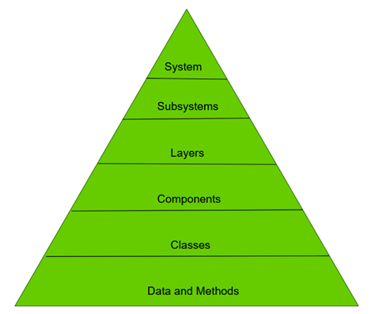{ width=800 height=600 align=center }
<figcaption>Levels of architectural abstraction</figcaption>
</figure>

At the top level, which is the most abstract representation of software, there is a system. A system may consist of a set one or more subsystems. Subsystems are typically divided into one or more layers. In the same way, layers are often divided into different components. Similarly, components contain classes that, in turn, contain data and methods.

## What is hexagonal architecture?
Hexagonal architecture, also known as ports and adapters architecture, is an architectural pattern that separates the business logic from the outside world. It involves APIs exposure or database integration. To understand whether this pattern is well implemented or not, one could ask themselves questions such as: What would happen if functionality was exposed through another protocol? Or what would happen if the database was changed? If the business logic was required to change too, then this would imply that the hexagonal architecture was poorly implemented. If not, then the pattern is proven to be implemented well.

<figure markdown>
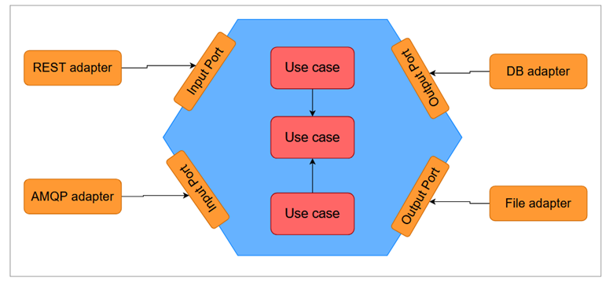{ width=800 height=600 align=center }
<figcaption>Hexagonal architecture</figcaption>
</figure>

As the image above shows, this pattern is represented by a hexagon where the business logic is placed in the center and the adapters are situated on the edges.
Hexagonal architecture can be implemented in DDD projects, because they complement each other. Although it is not required, it is a good practice to combine them because they aim for similar goals.

`Why is it good to invest in hexagonal architecture?`

The first reason to invest in hexagonal architecture comes from a cost-benefit argument. Not only is it beneficial from a technical perspective, but also from a business point of view. One of the primary goals of an architect is to minimize the cost of the creation and maintenance of software and, simultaneously, maximize the architecture’s benefits to the business.

The main benefit of hexagonal architecture for the organization is in the form of money. Companies invest a lot of capital every month in software maintenance, which can encompass refactoring or even rebuilding an application. Hexagonal architecture reduces the cost of maintenance by separating different parts of the application. This clear separation of responsibilities and layers allows us to evolve or change functionalities more easily.

For example, when we want to change from REST to gRPC, we only need to focus our efforts on the transport layer while the rest of the code can remain intact.

Hexagonal architecture is based on a few principles that should be followed to build well-structured components. If we overlook any of them, we will experience problems in the future. Additionally, it can be quite tortuous to change bad implementations, especially in a system that runs on production.

## SOLID principles
To implement components based on hexagonal architecture, it is necessary to understand the SOLID principles, which are as follows:

1.	The single-responsibility principle: This principle states that a class should only change due to one reason. The class should only execute one functionality.
2.	The open-close principle: This principle states that a class should be opened to extension, but closed to modification.
3.	Liskov’s substitution principle: This principle states that the objects of a superclass should be replaceable with the objects of its subclasses, and that this replacement will not cause a break in the system.
4.	The interface-segregation principle: This principle states that the use of one interface with many defined methods, which may not be required in some implementers, is not the best approach.
5.	The dependency-inversion principle: This principle states that high-level functions should be reusable and unaffected by changes in low-level functions. To follow this principle, it is necessary to introduce abstractions to decouple both the levels from one another. This is the most important principle that is used to implement hexagonal architecture.

### Clear-separation principle
There must be a clear separation of responsibilities. In every component, there is a way to identify these responsibilities through analysis. For example, we can identify these responsibilities if we analyze a specific action that is executed or a way that is used to save information. To comply with this principle, it is important to separate these functionalities from one another. The following image shows the basic form of the separation of responsibilities.

<figure markdown>
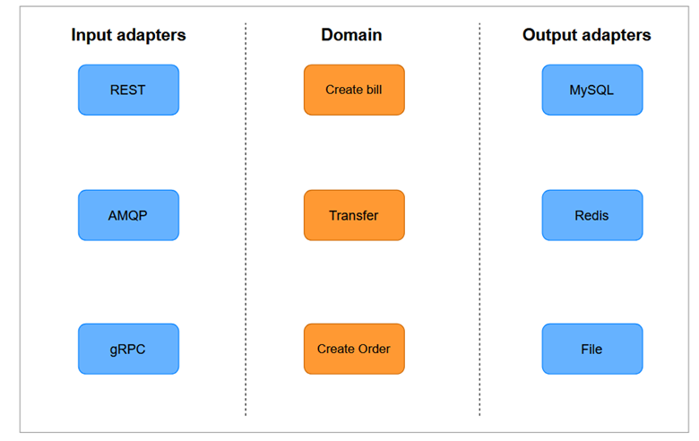{ width=800 height=600 align=center }
<figcaption>Separation of responsibilities</figcaption>
</figure>

Layer boundaries must be clearly defined. To comply with this principle, it is good practice to define interfaces that expose functionalities and the data that is required to execute them. Dependency between the layers should be based on the interfaces.

<figure markdown>
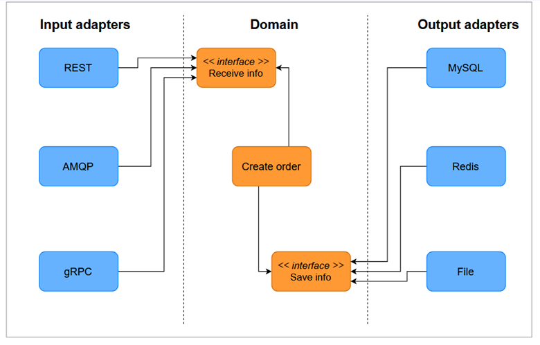{ width=800 height=600 align=center }
<figcaption>Well-defined boundaries</figcaption>
</figure>

#### Communication from the outside to the inside
Communication must always come from the outermost layer to the innermost one. This means that every execution starts in the API adapter. Business logic is executed afterward and, ultimately, the storage logic is also executed. Internal layers cannot know anything about the external layers.

#### Communication from the outside to the inside

`The layers of hexagonal architecture`
Hexagonal architecture defines four layers to structure a component. As was mentioned before, these layers are focused on all of the parts that an application consists of, such as frameworks, database connections, business flows, and so on. Let’s look at them one by one.

`Domain objects layer`
Located in the center of the hexagon, a domain contains all of the objects related to the business. In DDD terms, business objects are entities, value objects, and aggregates. Additionally, this layer contains all of the abstractions that are defined to carry out a business process. The abstractions are factories and the definition of repositories. Services can result in two possibilities. If the services interact with external dependencies, the domain layer will only have access to the services’ definition. If they do not interact with external dependencies, then the domain layer will have access to the full implementation.

<figure markdown>
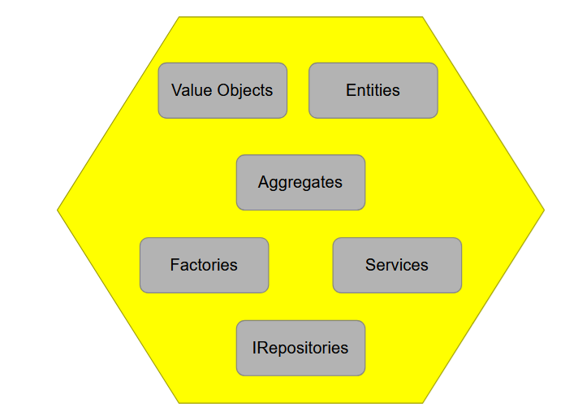{ width=800 height=600 align=center }
<figcaption>Domain Layer</figcaption>
</figure>

`Example definition`
This restaurant wants to allow a customer to order something through its website. The website consumes REST APIs to execute the business logic. Therefore, we have to implement a microservice that exposes the functionality to create an order. This use case displays the following restrictions:
- [x] If a customer has no previously created orders, it is possible to create a new order.
- [x] If a customer has already created an order, it is not possible to create a new order.

In the upcoming lessons, each layer of this microservice will be implemented in order to accomplish the business need.

`Model definition`
The following diagram depicts the domain layer and how the domain objects should be implemented to fulfill the business rules.

<figure markdown>
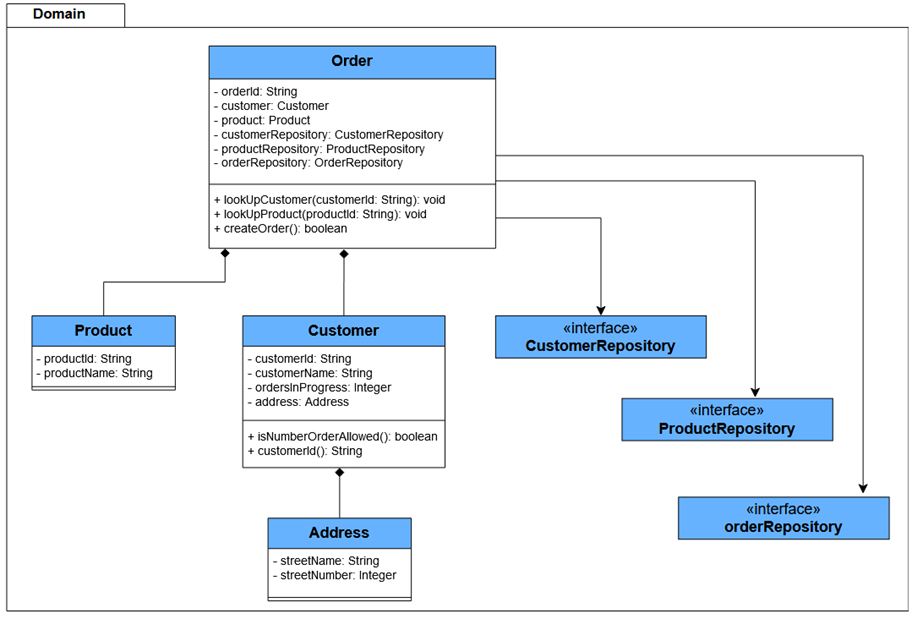{ width=800 height=600 align=center }
<figcaption>Domain package</figcaption>
</figure>

```java
package exampleCase.domain;

// Address is a value object
public class Address {

    // Attributes of this value object
    private String streetName;
    private Integer streetNumber;

    // Address is the only way to create this object
    public Address(String streetName, Integer streetNumber) {
        this.streetName = streetName;
        this.streetNumber = streetNumber;
    }
}
package exampleCase.domain;

// Customer is an entity
public class Product {

    // Attributes of this entity
    private String productId;
    private String productName;

    // Product is the only way to create this object
    public Product(String productId, String productName) {
        this.productId = productId;
        this.productName = productName;
    }
}
package exampleCase.domain;

// Customer is an aggregate root
public class Order {

    // Attributes of this aggregate root
    private String orderId;
    private Customer customer;
    private Product product;
    private CustomerRepository customerRepository;
    private ProductRepository productRepository;
    private OrderRepository orderRepository;

    // Order is the only way to create this object
    public Order(String orderId,CustomerRepository customerRepository, ProductRepository productRepository, OrderRepository orderRepository) {
        this.orderId = orderId;
        this.customerRepository = customerRepository;
        this.productRepository = productRepository;
        this.orderRepository = orderRepository;
    }
    // lookUpCustomer looks for customer information
    public void LookUpCustomer(String customerId){
        this.customer = this.customerRepository.getCustomer(customerId);
    }

    // lookUpProduct looks for product information
    public void lookUpProduct(String productId){
        this.product = this.productRepository.getProduct(productId);
    }

    // createOrder creates an order
    public boolean createOrder(){
        if(!this.customer.isNumberOrderAllowed()){
            return false;
        }

        return this.orderRepository.createOrder(this.orderId,this.customer);
    }
}
package exampleCase.domain;

// Customer is an entity
public class Customer {

    // Attributes of this entity
    private String customerId;
    private String customerName;
    private Integer ordersInProgress;
    private Address address;

    // Customer is the only way to create this object
    public Customer(String customerId, String customerName, Integer ordersInProgress,String streetName, Integer streetNumber) {
        this.customerId = customerId;
        this.customerName = customerName;
        this.ordersInProgress = ordersInProgress;
    }

    // isNumberOrderAllowed verifies whether customer has opened orders
    public boolean isNumberOrderAllowed(){
        return this.ordersInProgress == 0;
    }

    // customerId returns customerId value
    public String customerId() {
        return customerId;
    }
}
///
package exampleCase.domain;

public interface ProductRepository {

    // getProduct looks for information of a particular product
    public Product getProduct(String productId);
}
package exampleCase.domain;

public interface OrderRepository {

    // createOrder saves an order
    public boolean createOrder(String orderId, Customer customer);
}
package exampleCase.domain;

public interface CustomerRepository {

    // getCustomer looks for information of a particular customer
    public Customer getCustomer(String customerId);
}
```

The code above shows how we can translate a model into code. In this case, the code implements the business functionalities that were modeled in the diagram above.

### Use cases layer
The use cases layer exposes functionalities to fulfill business requirements. This layer is located on top of the domain object layer. It can orchestrate logic in an aggregate root, and between two or more of them if necessary. Suppose that there is a requirement to create an order in a restaurant. However, the customer cannot place another order, while the previous one is still in progress. To fulfill this requirement, we will need to search for customer-opened orders. It will be possible to execute the creation if the customer shows no record of opened orders. Otherwise, the request will be rejected. A use case layer can implement the previous scenario.

<figure markdown>
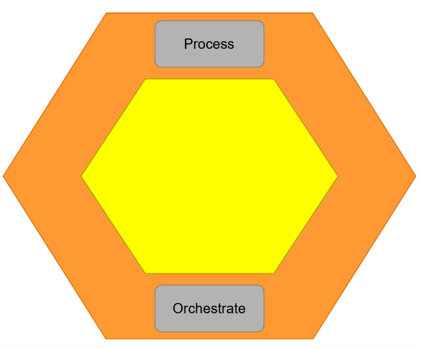{ width=800 height=600 align=center }
<figcaption>Use case layer</figcaption>
</figure>

This layer will be in charge of the orchestration of domain objects to fulfill business needs.
Model definition
The following diagram depicts the use case layer, which defines two artifacts. Additionally, this layer makes use of the domain layer.

`Model explanation`
This layer contains the following artifacts:

- [x] A CreateOrderinterface: This interface defines a method to carry out an order creation.
- [x] A CreateOrderImplobject: This object implements the CreateOrder interface. It orchestrates the logic to look up information about a customer and a product.

```java
package exampleCase.domain;

// Customer is an entity
public class Customer {

    // Attributes of this entity
    private String customerId;
    private String customerName;
    private Integer ordersInProgress;
    private Address address;

    // Customer is the only way to create this object
    public Customer(String customerId, String customerName, Integer ordersInProgress,String streetName, Integer streetNumber) {
        this.customerId = customerId;
        this.customerName = customerName;
        this.ordersInProgress = ordersInProgress;
    }

    // isNumberOrderAllowed verifies whether customer has opened orders
    public boolean isNumberOrderAllowed(){
        return this.ordersInProgress == 0;
    }

    // customerId returns customerId value
    public String customerId() {
        return customerId;
    }
}
package exampleCase.domain;

// Address is a value object
public class Address {

    // Attributes of this value object
    private String streetName;
    private Integer streetNumber;

    // Address is the only way to create this object
    public Address(String streetName, Integer streetNumber) {
        this.streetName = streetName;
        this.streetNumber = streetNumber;
    }
}
package exampleCase.domain;

// Customer is an aggregate root
public class Order {

    // Attributes of this aggregate root
    private String orderId;
    private Customer customer;
    private Product product;
    private CustomerRepository customerRepository;
    private ProductRepository productRepository;
    private OrderRepository orderRepository;

    // Order is the only way to create this object
    public Order(String orderId,CustomerRepository customerRepository, ProductRepository productRepository, OrderRepository orderRepository) {
        this.orderId = orderId;
        this.customerRepository = customerRepository;
        this.productRepository = productRepository;
        this.orderRepository = orderRepository;
    }
    // lookUpCustomer looks for customer information
    public void LookUpCustomer(String customerId){
        this.customer = this.customerRepository.getCustomer(customerId);
    }

    // lookUpProduct looks for product information
    public void lookUpProduct(String productId){
        this.product = this.productRepository.getProduct(productId);
    }

    // createOrder creates an order
    public boolean createOrder(){
        if(!this.customer.isNumberOrderAllowed()){
            return false;
        }

        return this.orderRepository.createOrder(this.orderId,this.customer);
    }
}
package exampleCase.domain;

// Customer is an entity
public class Product {

    // Attributes of this entity
    private String productId;
    private String productName;

    // Product is the only way to create this object
    public Product(String productId, String productName) {
        this.productId = productId;
        this.productName = productName;
    }
}
package exampleCase.useCase;

public interface CreateOrder {

    // createOrder defines function required to create an order
    public boolean createOrder(String orderId, String customerId, String productId);
}
package exampleCase.domain;

public interface OrderRepository {

    // createOrder saves an order
    public boolean createOrder(String orderId, Customer customer);
}
package exampleCase.domain;

public interface CustomerRepository {

    // getCustomer looks for information of a particular customer
    public Customer getCustomer(String customerId);
}
package exampleCase.useCase;

import exampleCase.domain.CustomerRepository;
import exampleCase.domain.Order;
import exampleCase.domain.ProductRepository;
import exampleCase.domain.OrderRepository;

// CreateOrderImpl defines is an use case
public class CreateOrderImpl implements CreateOrder {

    // Attributes of this object
    private CustomerRepository customerRepository;
    private ProductRepository productRepository;
    private OrderRepository orderRepository;

    @Autowired
    public CreateOrderImpl(CustomerRepository customerRepository, ProductRepository productRepository, OrderRepository orderRepository) {
        this.customerRepository = customerRepository;
        this.productRepository = productRepository;
        this.orderRepository = orderRepository;
    }

    // createOrder executes logic required to create an order
    @Override
    public boolean createOrder(String orderId, String customerId, String productId) {
        Order order = new Order(orderId,this.customerRepository,this.productRepository,this.orderRepository);
        order.LookUpCustomer(customerId);
        order.lookUpProduct(productId);
        return order.createOrder();
    }
}
```

<figure markdown>
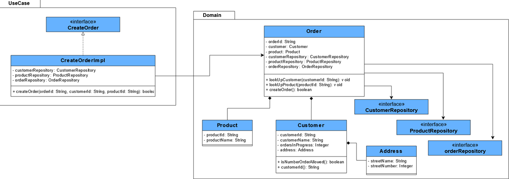{ width=800 height=600 align=center }
<figcaption>The code above shows how we can translate a model into code. In this case, the code implements an orchestration that controls the flow of the business logic.</figcaption>
</figure>

### Ports layer
A port is an interface, which defines the functions and the data required to carry them out. Ports are placed between the domain logic and the outside world that is designed for a particular purpose or protocol. They are used to allow outside clients to access the domain logic, and topermit the business logic to access the external systems. To compare a port with an example from the real world, we can say that it is a plug that exposes a particular interface. Ultimately, this layer is located after the use case layer.

<figure markdown>
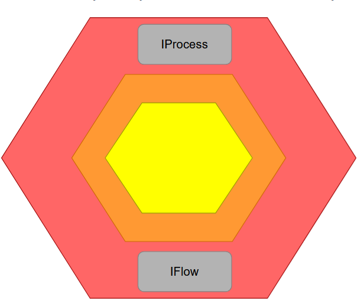{ width=800 height=600 align=center }
<figcaption>Ports layer</figcaption>
</figure>

It is important to mention that this layer will be in charge of exposing an interface, which will define the functionalities that a component offers and how we can invoke them.

<figure markdown>
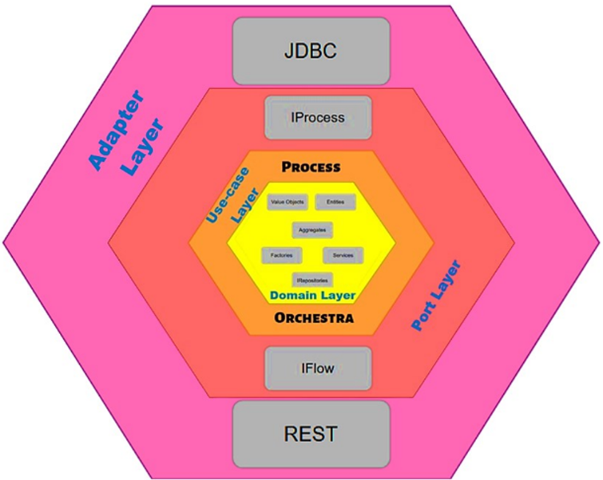{ width=800 height=600 align=center }
<figcaption>Final Model DDD</figcaption>
</figure>

#### Model definition
The following diagram depicts the port layer, which defines four artifacts. Additionally, this layer makes use of the use case layer.

<figure markdown>
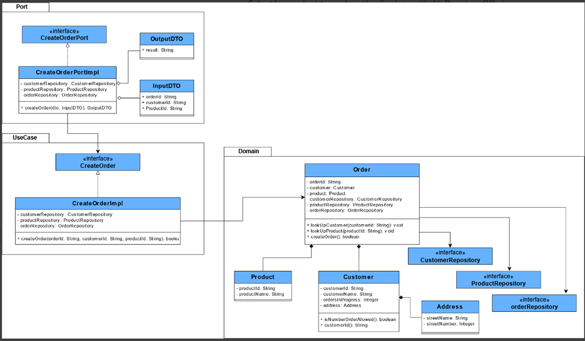{ width=800 height=600 align=center }
<figcaption>Class-digram</figcaption>
</figure>

```java
package exampleCase.domain;

// Address is a value object
public class Address {

    // Attributes of this value object
    private String streetName;
    private Integer streetNumber;

    // Address is the only way to create this object
    public Address(String streetName, Integer streetNumber) {
        this.streetName = streetName;
        this.streetNumber = streetNumber;
    }
}
package exampleCase.port;

// OutputDTO defines data returned after executing order creation
public class OutputDTO {
    public String result;
}
package exampleCase.port;

// InputDTO contains data required to create and order
public class InputDTO {
    public String orderId;
    public String customerId;
    public String productId;
}
package exampleCase.port;

import exampleCase.domain.CustomerRepository;
import exampleCase.domain.OrderRepository;
import exampleCase.domain.ProductRepository;
import exampleCase.useCase.CreateOrder;
import exampleCase.useCase.CreateOrderImpl;

// CreateOrderPortImpl is a port
public class CreateOrderPortImpl implements CreateOrderPort{

    // Attributes of this object
    private CustomerRepository customerRepository;
    private ProductRepository productRepository;
    private OrderRepository orderRepository;

    @Autowired
    public CreateOrderPortImpl(CustomerRepository customerRepository, ProductRepository productRepository, OrderRepository orderRepository) {
        this.customerRepository = customerRepository;
        this.productRepository = productRepository;
        this.orderRepository = orderRepository;
    }

    // CreateOrderPort executes an order creation
    @Override
    public OutputDTO createOrderPort(InputDTO dto) {
        CreateOrder createOrder = new CreateOrderImpl(this.customerRepository,this.productRepository, this.orderRepository);
        boolean result = createOrder.createOrder(dto.orderId,dto.customerId,dto.productId);
        OutputDTO res= new OutputDTO();
        if(result){
            res.result = "Creation successful";
        }else {
            res.result = "Creation failed";
        }

        return res;
    }
}

package exampleCase.port;

public interface CreateOrderPort {

    // createOrderPort exposes interface to create an order
    public OutputDTO createOrderPort(InputDTO dto);
}
package exampleCase.useCase;

import exampleCase.domain.CustomerRepository;
import exampleCase.domain.Order;
import exampleCase.domain.ProductRepository;
import exampleCase.domain.OrderRepository;

// CreateOrderImpl defines is an use case
public class CreateOrderImpl implements CreateOrder {

    // Attributes of this object
    private CustomerRepository customerRepository;
    private ProductRepository productRepository;
    private OrderRepository orderRepository;

    @Autowired
    public CreateOrderImpl(CustomerRepository customerRepository, ProductRepository productRepository, OrderRepository orderRepository) {
        this.customerRepository = customerRepository;
        this.productRepository = productRepository;
        this.orderRepository = orderRepository;
    }

    // createOrder executes logic required to create an order
    @Override
    public boolean createOrder(String orderId, String customerId, String productId) {
        Order order = new Order(orderId,this.customerRepository,this.productRepository,this.orderRepository);
        order.LookUpCustomer(customerId);
        order.lookUpProduct(productId);
        return order.createOrder();
    }
}
package exampleCase.useCase;

public interface CreateOrder {

    // createOrder defines function required to create an order
    public boolean createOrder(String orderId, String customerId, String productId);
}
package exampleCase.domain;

public interface ProductRepository {

    // getProduct looks for information of a particular product
    public Product getProduct(String productId);
}
package exampleCase.domain;

// Customer is an entity
public class Product {

    // Attributes of this entity
    private String productId;
    private String productName;

    // Product is the only way to create this object
    public Product(String productId, String productName) {
        this.productId = productId;
        this.productName = productName;
    }
}
package exampleCase.domain;

public interface OrderRepository {

    // createOrder saves an order
    public boolean createOrder(String orderId, Customer customer);
}
package exampleCase.domain;

// Customer is an aggregate root
public class Order {

    // Attributes of this aggregate root
    private String orderId;
    private Customer customer;
    private Product product;
    private CustomerRepository customerRepository;
    private ProductRepository productRepository;
    private OrderRepository orderRepository;

    // Order is the only way to create this object
    public Order(String orderId,CustomerRepository customerRepository, ProductRepository productRepository, OrderRepository orderRepository) {
        this.orderId = orderId;
        this.customerRepository = customerRepository;
        this.productRepository = productRepository;
        this.orderRepository = orderRepository;
    }
    // lookUpCustomer looks for customer information
    public void LookUpCustomer(String customerId){
        this.customer = this.customerRepository.getCustomer(customerId);
    }

    // lookUpProduct looks for product information
    public void lookUpProduct(String productId){
        this.product = this.productRepository.getProduct(productId);
    }

    // createOrder creates an order
    public boolean createOrder(){
        if(!this.customer.isNumberOrderAllowed()){
            return false;
        }

        return this.orderRepository.createOrder(this.orderId,this.customer);
    }
}
package exampleCase.domain;

public interface CustomerRepository {

    // getCustomer looks for information of a particular customer
    public Customer getCustomer(String customerId);
}
package exampleCase.domain;

// Customer is an entity
public class Customer {

    // Attributes of this entity
    private String customerId;
    private String customerName;
    private Integer ordersInProgress;
    private Address address;

    // Customer is the only way to create this object
    public Customer(String customerId, String customerName, Integer ordersInProgress,String streetName, Integer streetNumber) {
        this.customerId = customerId;
        this.customerName = customerName;
        this.ordersInProgress = ordersInProgress;
    }

    // isNumberOrderAllowed verifies whether customer has opened orders
    public boolean isNumberOrderAllowed(){
        return this.ordersInProgress == 0;
    }

    // customerId returns customerId value
    public String customerId() {
        return customerId;
    }
}
```

The code above shows how we can translate a model into code. In this case, the code will implement a type of interface that will allow adapters to invoke business functionalities.

### Adapters layer
The adapters layer is the outermost layer of the hexagonal architecture. It interacts with the outside world directly. An adapter uses a specific technology. Therefore, this layer has a high coupling with a specific technological stack. Such a stack may be REST or gRPC, which are used to expose functionalities, or it may be JDBC or Cache, which are used to store information.
The implementation of an adapter allows the external systems to execute the domain logic. An adapter must comply with the interface definition and send all of the required data to achieve that interaction.

<figure markdown>
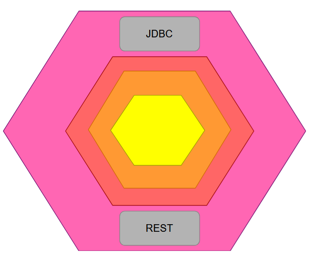{ width=800 height=600 align=center }
<figcaption>Adapter Layer</figcaption>
</figure>

 This layer is in charge of communication with the outside world, for example, communication with database connections, HTTP, and so on.

#### Model definition
The following diagram depicts the adapter layer, which defines six artifacts. Additionally, this layer makes use of the port layer. Due to its large size, this model is divided into two parts. Part one shows the domain, use case, and port layers, whereas part two shows the interaction between the port and abstract layers.

<figure markdown>
{ width=800 height=600 align=center }
<figcaption>Adapter Layer</figcaption>
</figure>

The image above shows what was implemented previously. Now, it is time to understand how the adapter layer interacts only with the port layer. This interaction can be seen in the image below.

<figure markdown>
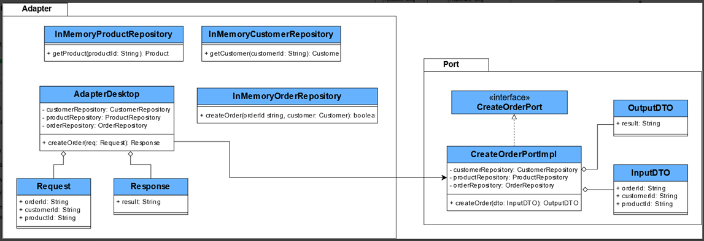{ width=800 height=600 align=center }
<figcaption>Adapter-class-digram</figcaption>
</figure>

```java
// Customer is an entity
public class Customer {

    // Attributes of this entity
    private String customerId;
    private String customerName;
    private Integer ordersInProgress;
    private Address address;

    // Customer is the only way to create this object
    public Customer(String customerId, String customerName, Integer ordersInProgress,String streetName, Integer streetNumber) {
        this.customerId = customerId;
        this.customerName = customerName;
        this.ordersInProgress = ordersInProgress;
    }

    // isNumberOrderAllowed verifies whether customer has opened orders
    public boolean isNumberOrderAllowed(){
        return this.ordersInProgress == 0;
    }

    // customerId returns customerId value
    public String customerId() {
        return customerId;
    }
}
public interface CustomerRepository {

    // getCustomer looks for information of a particular customer
    public Customer getCustomer(String customerId);
}
// Customer is an aggregate root
public class Order {

    // Attributes of this aggregate root
    private String orderId;
    private Customer customer;
    private Product product;
    private CustomerRepository customerRepository;
    private ProductRepository productRepository;
    private OrderRepository orderRepository;

    // Order is the only way to create this object
    public Order(String orderId,CustomerRepository customerRepository, ProductRepository productRepository, OrderRepository orderRepository) {
        this.orderId = orderId;
        this.customerRepository = customerRepository;
        this.productRepository = productRepository;
        this.orderRepository = orderRepository;
    }
    // lookUpCustomer looks for customer information
    public void LookUpCustomer(String customerId){
        this.customer = this.customerRepository.getCustomer(customerId);
    }

    // lookUpProduct looks for product information
    public void lookUpProduct(String productId){
        this.product = this.productRepository.getProduct(productId);
    }

    // createOrder creates an order
    public boolean createOrder(){
        if(!this.customer.isNumberOrderAllowed()){
            return false;
        }

        return this.orderRepository.createOrder(this.orderId,this.customer);
    }
}
public interface OrderRepository {

    // createOrder saves an order
    public boolean createOrder(String orderId, Customer customer);
}
// Customer is an entity
public class Product {

    // Attributes of this entity
    private String productId;
    private String productName;

    // Product is the only way to create this object
    public Product(String productId, String productName) {
        this.productId = productId;
        this.productName = productName;
    }
}
public interface ProductRepository {

    // getProduct looks for information of a particular product
    public Product getProduct(String productId);
}
public interface CreateOrder {

    // createOrder defines function required to create an order
    public boolean createOrder(String orderId, String customerId, String productId);
}
// CreateOrderImpl defines is an use case
public class CreateOrderImpl implements CreateOrder {

    // Attributes of this object
    private CustomerRepository customerRepository;
    private ProductRepository productRepository;
    private OrderRepository orderRepository;

    public CreateOrderImpl(CustomerRepository customerRepository, ProductRepository productRepository, OrderRepository orderRepository) {
        this.customerRepository = customerRepository;
        this.productRepository = productRepository;
        this.orderRepository = orderRepository;
    }

    // createOrder executes logic required to create an order
    @Override
    public boolean createOrder(String orderId, String customerId, String productId) {
        Order order = new Order(orderId,this.customerRepository,this.productRepository,this.orderRepository);
        order.LookUpCustomer(customerId);
        order.lookUpProduct(productId);
        return order.createOrder();
    }
}
public interface CreateOrderPort {

    // createOrderPort exposes interface to create an order
    public OutputDTO createOrderPort(InputDTO dto);
}
// CreateOrderPortImpl is a port
public class CreateOrderPortImpl implements CreateOrderPort{

    // Attributes of this object
    private CustomerRepository customerRepository;
    private ProductRepository productRepository;
    private OrderRepository orderRepository;

    public CreateOrderPortImpl(CustomerRepository customerRepository, ProductRepository productRepository, OrderRepository orderRepository) {
        this.customerRepository = customerRepository;
        this.productRepository = productRepository;
        this.orderRepository = orderRepository;
    }

    // CreateOrderPort executes an order creation
    @Override
    public OutputDTO createOrderPort(InputDTO dto) {
        CreateOrder createOrder = new CreateOrderImpl(this.customerRepository,this.productRepository, this.orderRepository);
        boolean result = createOrder.createOrder(dto.orderId,dto.customerId,dto.productId);
        OutputDTO res= new OutputDTO();
        if(result){
            res.result = "Creation successful";
        }else {
            res.result = "Creation failed";
        }

        return res;
    }
}
// InputDTO contains data required to create and order
public class InputDTO {
    public String orderId;
    public String customerId;
    public String productId;
}
// OutputDTO defines data returned after executing order creation
public class OutputDTO {
    public String result;
}
public class InMemoryCustomerRepository implements CustomerRepository{

    // getCustomer implements interface CustomerRepository, it mocks a store system
    @Override
    public Customer getCustomer(String customerId) {
        return new Customer(customerId,"DDD",0,"educative",1);
    }
}
public class InMemoryOrderRepository implements OrderRepository {

    // createOrder implements interface OrderRepository, it mocks a store system
    @Override
    public boolean createOrder(String orderId, Customer customer) {
        System.out.println(String.format("Creating order %s to customer %s",orderId,customer.customerId()));
        return true;
    }
}
public class InMemoryProductRepository implements ProductRepository {

    // getProduct implements interface CustomerRepository, it mocks a store system
    @Override
    public Product getProduct(String productId) {
        return new Product(productId,"pizza");
    }
}
// Request defines input rest fields
public class Request {
    public String orderId;
    public String customerId;
    public String productId;

    public Request(String orderId, String customerId, String productId) {
        this.orderId = orderId;
        this.customerId = customerId;
        this.productId = productId;
    }
}
// Response defines output rest fields
public class Response {
    public String result;
}
// AdapterDesktop is the adapter
public class AdapterDesktop {

    private CustomerRepository customerRepository;
    private ProductRepository productRepository;
    private OrderRepository orderRepository;

    public AdapterDesktop(CustomerRepository customerRepository, ProductRepository productRepository, OrderRepository orderRepository) {
        this.customerRepository = customerRepository;
        this.productRepository = productRepository;
        this.orderRepository = orderRepository;
    }

    // createOrder executes creation of an order
    public Response createOrder(Request req){
        InputDTO inputDTO = new InputDTO();
        inputDTO.customerId = req.customerId;
        inputDTO.productId=req.productId;
        inputDTO.orderId=req.orderId;

        // Invokes function that the create order port exposes
        CreateOrderPort adapter = new CreateOrderPortImpl(this.customerRepository,this.productRepository,this.orderRepository);
        Response res = new Response();
        res.result = adapter.createOrderPort(inputDTO).result;
        return res;
    }

    public static void main(String[] args) {
        // Instantiation oof dependencies
        CustomerRepository customerRepository = new InMemoryCustomerRepository();
        OrderRepository orderRepository = new InMemoryOrderRepository();
        ProductRepository productRepository = new InMemoryProductRepository();
        Request req = new Request("O-1234","1234","P-24244");

        AdapterDesktop adapterDesktop = new AdapterDesktop(customerRepository,productRepository,orderRepository);

        System.out.println("Before creating an order");

        Response res = adapterDesktop.createOrder(req);

        System.out.println("\nAfter creating an order the result is: "+ res.result);
    }
}
// Address is a value object
public class Address {

    // Attributes of this value object
    private String streetName;
    private Integer streetNumber;

    // Address is the only way to create this object
    public Address(String streetName, Integer streetNumber) {
        this.streetName = streetName;
        this.streetNumber = streetNumber;
    }
}
```

The code above shows how we can translate a model into code. In this case, the code implements an adapter that invokes business capabilities through interaction with a port.

Output

```text
1.4s
Before creating an order Creating order O-1234 to customer 1234 After creating an order the result is: Creation successful.
```

### The benefits of hexagonal architecture are as follows:
- [x] Hexagonal architecture has a well-defined dependency structure, which results in a clear domain model implementation.
- [x] It emphasizes the domain logic, which is a good match within a DDD context.
- [x] It clearly defines what to put in the code and where. That definition is important to maintain the code. It helps in faster, more focused, and automated tests for domain logic, mocking databases, and other external services.
- [x] An independent and incremental evolution of concerns is possible with hexagonal architecture. This means that every layer can evolve independently.
- [x] It allows the domain model to evolve to fulfill business requirements, without breaking APIs or migrating a database on every refactoring.


<figure markdown>
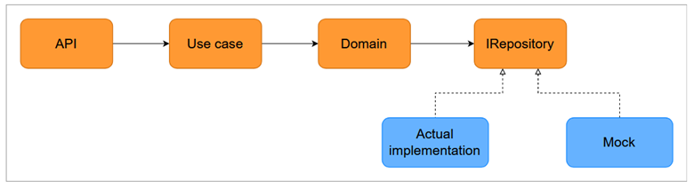{ width=800 height=600 align=center }
<figcaption>Different implementations of a repository</figcaption>
</figure>

Drawbacks of hexagonal architecture
- [x] The domain layer tends to become huge, as it can contain many objects if there is no good analysis of bounded contexts.
- [x] With several levels of indirection and isolation, the cost of building and maintaining the application may increase. Therefore, applications with hexagonal architecture can become more complex.
- [x] Complexity may increase, since applications are built with different levels of abstraction.
- [x] Performance may be affected, as a request must pass through different layers and it may imply more classes than the usual.
- [x] Hexagonal architecture will overcomplicate a project if changing the database regularly or exposing functionality through different protocols is not a requirement.

<figure markdown>
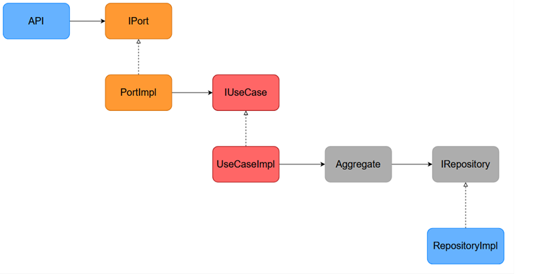{ width=800 height=600 align=center }
<figcaption>Many parts involved in a request</figcaption>
</figure>

---

> Which is the bottom-most level of architectural abstraction?

A) Layers
B) Classes
C) Data and methods
D)None of the above

> What is the port layer in hexagonal architecture?

A) A layer where the business logic is placed.
B) A strategy for the isolation of business flows from rules validation.
Correct Answer
C) A layer where an interface is exposed to allow us to consume business logic.
D) None of the above


> Which SOLID principle helps in the isolation of the domain layer from the adapter layer?

A) Single-responsibility principle
B) Interface-segregation principle
Correct Answer
C) Dependency-inversion principle
D)None of the above

> Which layer should the domain layer have a relationship with?

A) The adapter layer
B) The port layer
C) The use case layer
Correct Answer
D)None of the above (The Domain layer must not know anything about the others.)

> Adapters are the most important layer in hexagonal architecture?

A) True
Correct Answer
B) False


